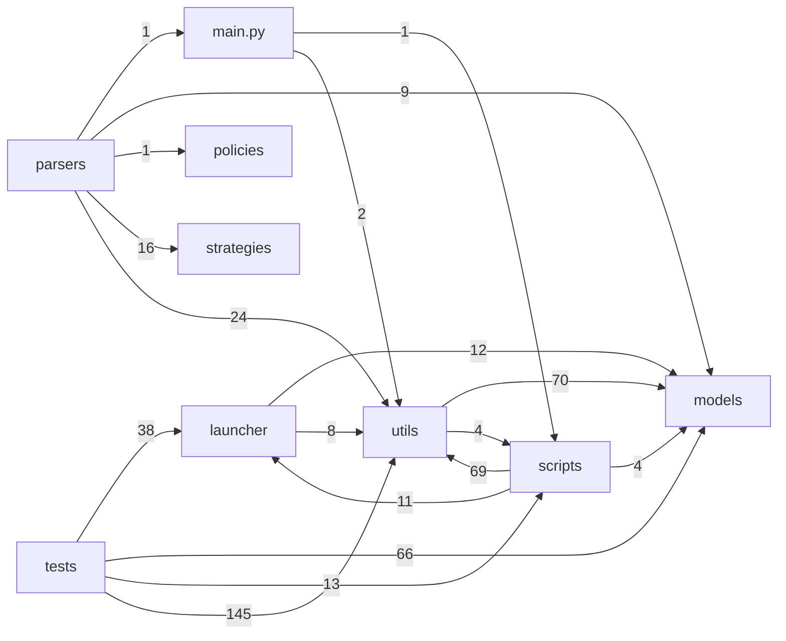

# ParserRIba Project File Flow Map

Generated by `scripts/generate_project_flow_map.py`.

Scope: tracked project Python sources, tests and scripts. Local runtime artifacts such as
`.venv/`, `archive/`, `data/`, `logs/`, `profiles/`, `build/`,
`dist/` and `generated_scaffolds/` are excluded from the import graph.

## How To Read This

- `Imports` means direct local Python imports detected by AST.
- `Imported by` excludes tests, so it approximates production/runtime use.
- `Tests` shows test files that import the source directly.
- Cleanup candidates require manual confirmation before removal.

## Main Runtime Flows

### Desktop launcher

```mermaid
flowchart TD
  n_scripts_run_desktop_launcher[scripts<br/>run_desktop_launcher.py]
  n_scripts_run_desktop_launcher[scripts<br/>run_desktop_launcher.py] --> n_launcher[launcher<br/>__init__.py]
  n_scripts_run_desktop_launcher[scripts<br/>run_desktop_launcher.py] --> n_launcher_desktop_launcher[launcher<br/>desktop_launcher.py]
  n_launcher_desktop_launcher[launcher<br/>desktop_launcher.py] --> n_launcher[launcher<br/>__init__.py]
  n_launcher_desktop_launcher[launcher<br/>desktop_launcher.py] --> n_launcher_desktop_action_state[launcher<br/>desktop_action_state.py]
  n_launcher_desktop_action_state[launcher<br/>desktop_action_state.py] --> n_models[models<br/>__init__.py]
  n_launcher_desktop_action_state[launcher<br/>desktop_action_state.py] --> n_models_launcher_state[models<br/>launcher_state.py]
  n_launcher_desktop_launcher[launcher<br/>desktop_launcher.py] --> n_launcher_desktop_background_task[launcher<br/>desktop_background_task.py]
  n_launcher_desktop_launcher[launcher<br/>desktop_launcher.py] --> n_launcher_desktop_controller[launcher<br/>desktop_controller.py]
  n_launcher_desktop_controller[launcher<br/>desktop_controller.py] --> n_launcher[launcher<br/>__init__.py]
  n_launcher_desktop_controller[launcher<br/>desktop_controller.py] --> n_launcher_desktop_controller_helpers[launcher<br/>desktop_controller_helpers.py]
  n_launcher_desktop_controller_helpers[launcher<br/>desktop_controller_helpers.py] --> n_utils[utils<br/>__init__.py]
  n_launcher_desktop_controller_helpers[launcher<br/>desktop_controller_helpers.py] --> n_utils_local_task_adapter[utils<br/>local_task_adapter.py]
  n_launcher_desktop_controller[launcher<br/>desktop_controller.py] --> n_launcher_desktop_controller_research[launcher<br/>desktop_controller_research.py]
  n_launcher_desktop_controller_research[launcher<br/>desktop_controller_research.py] --> n_launcher[launcher<br/>__init__.py]
  n_launcher_desktop_controller_research[launcher<br/>desktop_controller_research.py] --> n_launcher_desktop_ui_text[launcher<br/>desktop_ui_text.py]
  n_launcher_desktop_controller_research[launcher<br/>desktop_controller_research.py] --> n_models[models<br/>__init__.py]
  n_launcher_desktop_controller_research[launcher<br/>desktop_controller_research.py] --> n_models_launcher_state[models<br/>launcher_state.py]
  n_launcher_desktop_controller_research[launcher<br/>desktop_controller_research.py] --> n_utils[utils<br/>__init__.py]
  n_launcher_desktop_controller_research[launcher<br/>desktop_controller_research.py] --> n_utils_local_task_adapter[utils<br/>local_task_adapter.py]
  n_launcher_desktop_controller[launcher<br/>desktop_controller.py] --> n_launcher_desktop_controller_selection[launcher<br/>desktop_controller_selection.py]
  n_launcher_desktop_controller_selection[launcher<br/>desktop_controller_selection.py] --> n_models[models<br/>__init__.py]
  n_launcher_desktop_controller_selection[launcher<br/>desktop_controller_selection.py] --> n_models_launcher_state[models<br/>launcher_state.py]
  n_launcher_desktop_controller[launcher<br/>desktop_controller.py] --> n_launcher_desktop_export_facets[launcher<br/>desktop_export_facets.py]
  n_launcher_desktop_controller[launcher<br/>desktop_controller.py] --> n_launcher_desktop_user_messages[launcher<br/>desktop_user_messages.py]
  n_launcher_desktop_controller[launcher<br/>desktop_controller.py] --> n_utils[utils<br/>__init__.py]
  n_launcher_desktop_controller[launcher<br/>desktop_controller.py] --> n_utils_launcher_settings[utils<br/>launcher_settings.py]
  n_utils_launcher_settings[utils<br/>launcher_settings.py] --> n_models[models<br/>__init__.py]
  n_utils_launcher_settings[utils<br/>launcher_settings.py] --> n_models_launcher_state[models<br/>launcher_state.py]
  n_launcher_desktop_controller[launcher<br/>desktop_controller.py] --> n_utils_launcher_task_controller[utils<br/>launcher_task_controller.py]
  n_utils_launcher_task_controller[utils<br/>launcher_task_controller.py] --> n_utils[utils<br/>__init__.py]
  n_utils_launcher_task_controller[utils<br/>launcher_task_controller.py] --> n_utils_kb_loader[utils<br/>kb_loader.py]
  n_utils_launcher_task_controller[utils<br/>launcher_task_controller.py] --> n_utils_local_task_adapter[utils<br/>local_task_adapter.py]
  n_utils_launcher_task_controller[utils<br/>launcher_task_controller.py] --> n_utils_store_catalog_registry[utils<br/>store_catalog_registry.py]
  n_launcher_desktop_controller[launcher<br/>desktop_controller.py] --> n_utils_local_task_adapter[utils<br/>local_task_adapter.py]
  n_utils_local_task_adapter[utils<br/>local_task_adapter.py] --> n_models[models<br/>__init__.py]
  n_utils_local_task_adapter[utils<br/>local_task_adapter.py] --> n_models_task_actor[models<br/>task_actor.py]
  n_utils_local_task_adapter[utils<br/>local_task_adapter.py] --> n_utils[utils<br/>__init__.py]
  n_utils_local_task_adapter[utils<br/>local_task_adapter.py] --> n_utils_launcher_task_view[utils<br/>launcher_task_view.py]
  n_launcher_desktop_launcher[launcher<br/>desktop_launcher.py] --> n_launcher_desktop_filter_panel[launcher<br/>desktop_filter_panel.py]
  n_launcher_desktop_filter_panel[launcher<br/>desktop_filter_panel.py] --> n_launcher[launcher<br/>__init__.py]
  n_launcher_desktop_filter_panel[launcher<br/>desktop_filter_panel.py] --> n_launcher_desktop_dynamic_filter_panel[launcher<br/>desktop_dynamic_filter_panel.py]
  n_launcher_desktop_dynamic_filter_panel[launcher<br/>desktop_dynamic_filter_panel.py] --> n_launcher[launcher<br/>__init__.py]
  n_launcher_desktop_dynamic_filter_panel[launcher<br/>desktop_dynamic_filter_panel.py] --> n_launcher_desktop_ui_text[launcher<br/>desktop_ui_text.py]
  n_launcher_desktop_filter_panel[launcher<br/>desktop_filter_panel.py] --> n_launcher_desktop_filter_helpers[launcher<br/>desktop_filter_helpers.py]
  n_launcher_desktop_filter_panel[launcher<br/>desktop_filter_panel.py] --> n_launcher_desktop_ui_text[launcher<br/>desktop_ui_text.py]
  n_launcher_desktop_launcher[launcher<br/>desktop_launcher.py] --> n_launcher_desktop_interaction_state[launcher<br/>desktop_interaction_state.py]
  n_launcher_desktop_launcher[launcher<br/>desktop_launcher.py] --> n_launcher_desktop_product_details[launcher<br/>desktop_product_details.py]
  n_launcher_desktop_launcher[launcher<br/>desktop_launcher.py] --> n_launcher_desktop_result_table[launcher<br/>desktop_result_table.py]
  n_launcher_desktop_result_table[launcher<br/>desktop_result_table.py] --> n_launcher[launcher<br/>__init__.py]
  n_launcher_desktop_result_table[launcher<br/>desktop_result_table.py] --> n_launcher_desktop_ui_text[launcher<br/>desktop_ui_text.py]
  n_launcher_desktop_result_table[launcher<br/>desktop_result_table.py] --> n_models[models<br/>__init__.py]
  n_launcher_desktop_result_table[launcher<br/>desktop_result_table.py] --> n_models_launcher_state[models<br/>launcher_state.py]
  n_launcher_desktop_launcher[launcher<br/>desktop_launcher.py] --> n_launcher_desktop_result_table_widget[launcher<br/>desktop_result_table_widget.py]
  n_launcher_desktop_launcher[launcher<br/>desktop_launcher.py] --> n_launcher_desktop_selection_panel[launcher<br/>desktop_selection_panel.py]
  n_launcher_desktop_selection_panel[launcher<br/>desktop_selection_panel.py] --> n_launcher[launcher<br/>__init__.py]
  n_launcher_desktop_selection_panel[launcher<br/>desktop_selection_panel.py] --> n_launcher_desktop_catalog_tree_widget[launcher<br/>desktop_catalog_tree_widget.py]
  n_launcher_desktop_selection_panel[launcher<br/>desktop_selection_panel.py] --> n_launcher_desktop_ui_text[launcher<br/>desktop_ui_text.py]
  n_launcher_desktop_launcher[launcher<br/>desktop_launcher.py] --> n_launcher_desktop_shell_helpers[launcher<br/>desktop_shell_helpers.py]
  n_launcher_desktop_shell_helpers[launcher<br/>desktop_shell_helpers.py] --> n_launcher[launcher<br/>__init__.py]
  n_launcher_desktop_shell_helpers[launcher<br/>desktop_shell_helpers.py] --> n_launcher_desktop_catalog_tree_widget[launcher<br/>desktop_catalog_tree_widget.py]
  n_launcher_desktop_shell_helpers[launcher<br/>desktop_shell_helpers.py] --> n_launcher_desktop_list_widget_helpers[launcher<br/>desktop_list_widget_helpers.py]
  n_launcher_desktop_launcher[launcher<br/>desktop_launcher.py] --> n_launcher_desktop_ui_text[launcher<br/>desktop_ui_text.py]
  n_launcher_desktop_launcher[launcher<br/>desktop_launcher.py] --> n_launcher_desktop_view_helpers[launcher<br/>desktop_view_helpers.py]
  n_launcher_desktop_view_helpers[launcher<br/>desktop_view_helpers.py] --> n_launcher[launcher<br/>__init__.py]
  n_launcher_desktop_view_helpers[launcher<br/>desktop_view_helpers.py] --> n_launcher_desktop_result_table[launcher<br/>desktop_result_table.py]
  n_launcher_desktop_view_helpers[launcher<br/>desktop_view_helpers.py] --> n_launcher_desktop_ui_text[launcher<br/>desktop_ui_text.py]
  n_launcher_desktop_view_helpers[launcher<br/>desktop_view_helpers.py] --> n_models[models<br/>__init__.py]
  n_launcher_desktop_view_helpers[launcher<br/>desktop_view_helpers.py] --> n_models_launcher_state[models<br/>launcher_state.py]
  n_launcher_desktop_launcher[launcher<br/>desktop_launcher.py] --> n_launcher_desktop_workflow_tabs[launcher<br/>desktop_workflow_tabs.py]
  n_launcher_desktop_workflow_tabs[launcher<br/>desktop_workflow_tabs.py] --> n_launcher[launcher<br/>__init__.py]
  n_launcher_desktop_workflow_tabs[launcher<br/>desktop_workflow_tabs.py] --> n_launcher_desktop_filter_panel[launcher<br/>desktop_filter_panel.py]
  n_launcher_desktop_workflow_tabs[launcher<br/>desktop_workflow_tabs.py] --> n_launcher_desktop_selection_panel[launcher<br/>desktop_selection_panel.py]
  n_launcher_desktop_workflow_tabs[launcher<br/>desktop_workflow_tabs.py] --> n_launcher_desktop_window_sections[launcher<br/>desktop_window_sections.py]
  n_launcher_desktop_window_sections[launcher<br/>desktop_window_sections.py] --> n_launcher[launcher<br/>__init__.py]
  n_launcher_desktop_window_sections[launcher<br/>desktop_window_sections.py] --> n_launcher_desktop_ui_text[launcher<br/>desktop_ui_text.py]
  n_scripts_run_desktop_launcher[scripts<br/>run_desktop_launcher.py] --> n_scripts_smoke_desktop_launcher[scripts<br/>smoke_desktop_launcher.py]
  n_scripts_smoke_desktop_launcher[scripts<br/>smoke_desktop_launcher.py] --> n_launcher[launcher<br/>__init__.py]
  n_scripts_smoke_desktop_launcher[scripts<br/>smoke_desktop_launcher.py] --> n_launcher_desktop_launcher[launcher<br/>desktop_launcher.py]
```


### Local task CLI
```mermaid
flowchart TD
  n_scripts_run_local_task[scripts<br/>run_local_task.py]
  n_scripts_run_local_task[scripts<br/>run_local_task.py] --> n_utils[utils<br/>__init__.py]
  n_scripts_run_local_task[scripts<br/>run_local_task.py] --> n_utils_local_task_registry[utils<br/>local_task_registry.py]
  n_utils_local_task_registry[utils<br/>local_task_registry.py] --> n_models[models<br/>__init__.py]
  n_utils_local_task_registry[utils<br/>local_task_registry.py] --> n_models_report_request[models<br/>report_request.py]
  n_utils_local_task_registry[utils<br/>local_task_registry.py] --> n_models_task_actor[models<br/>task_actor.py]
  n_utils_local_task_registry[utils<br/>local_task_registry.py] --> n_utils[utils<br/>__init__.py]
  n_utils_local_task_registry[utils<br/>local_task_registry.py] --> n_utils_kb_loader[utils<br/>kb_loader.py]
  n_utils_kb_loader[utils<br/>kb_loader.py] --> n_utils[utils<br/>__init__.py]
  n_utils_kb_loader[utils<br/>kb_loader.py] --> n_utils_kb_interception[utils<br/>kb_interception.py]
  n_utils_local_task_registry[utils<br/>local_task_registry.py] --> n_utils_run_manifest[utils<br/>run_manifest.py]
  n_utils_run_manifest[utils<br/>run_manifest.py] --> n_models[models<br/>__init__.py]
  n_utils_run_manifest[utils<br/>run_manifest.py] --> n_models_onboarding[models<br/>onboarding.py]
  n_utils_run_manifest[utils<br/>run_manifest.py] --> n_models_task_actor[models<br/>task_actor.py]
  n_utils_run_manifest[utils<br/>run_manifest.py] --> n_utils[utils<br/>__init__.py]
  n_utils_run_manifest[utils<br/>run_manifest.py] --> n_utils_export_summary[utils<br/>export_summary.py]
  n_utils_local_task_registry[utils<br/>local_task_registry.py] --> n_utils_site_onboarding[utils<br/>site_onboarding.py]
  n_utils_site_onboarding[utils<br/>site_onboarding.py] --> n_models[models<br/>__init__.py]
  n_utils_site_onboarding[utils<br/>site_onboarding.py] --> n_models_catalog_discovery[models<br/>catalog_discovery.py]
  n_utils_site_onboarding[utils<br/>site_onboarding.py] --> n_models_onboarding[models<br/>onboarding.py]
  n_utils_site_onboarding[utils<br/>site_onboarding.py] --> n_utils[utils<br/>__init__.py]
  n_utils_site_onboarding[utils<br/>site_onboarding.py] --> n_utils_browser_catalog_discovery[utils<br/>browser_catalog_discovery.py]
  n_utils_browser_catalog_discovery[utils<br/>browser_catalog_discovery.py] --> n_models[models<br/>__init__.py]
  n_utils_browser_catalog_discovery[utils<br/>browser_catalog_discovery.py] --> n_models_catalog_discovery[models<br/>catalog_discovery.py]
  n_utils_browser_catalog_discovery[utils<br/>browser_catalog_discovery.py] --> n_scripts_discover_pyaterochka_api[scripts<br/>discover_pyaterochka_api.py]
  n_utils_browser_catalog_discovery[utils<br/>browser_catalog_discovery.py] --> n_utils[utils<br/>__init__.py]
  n_utils_browser_catalog_discovery[utils<br/>browser_catalog_discovery.py] --> n_utils_antibot[utils<br/>antibot.py]
  n_utils_browser_catalog_discovery[utils<br/>browser_catalog_discovery.py] --> n_utils_camoufox_launcher[utils<br/>camoufox_launcher.py]
  n_utils_browser_catalog_discovery[utils<br/>browser_catalog_discovery.py] --> n_utils_catalog_tree_discovery[utils<br/>catalog_tree_discovery<br/>__init__.py]
  n_utils_browser_catalog_discovery[utils<br/>browser_catalog_discovery.py] --> n_utils_catalog_tree_discovery_research_walker[utils<br/>catalog_tree_discovery<br/>research_walker.py]
  n_utils_browser_catalog_discovery[utils<br/>browser_catalog_discovery.py] --> n_utils_env[utils<br/>env.py]
  n_utils_browser_catalog_discovery[utils<br/>browser_catalog_discovery.py] --> n_utils_human_behavior[utils<br/>human_behavior.py]
  n_utils_browser_catalog_discovery[utils<br/>browser_catalog_discovery.py] --> n_utils_kb_loader[utils<br/>kb_loader.py]
  n_utils_browser_catalog_discovery[utils<br/>browser_catalog_discovery.py] --> n_utils_proxy[utils<br/>proxy.py]
  n_utils_site_onboarding[utils<br/>site_onboarding.py] --> n_utils_catalog_discovery[utils<br/>catalog_discovery.py]
  n_utils_catalog_discovery[utils<br/>catalog_discovery.py] --> n_models[models<br/>__init__.py]
  n_utils_catalog_discovery[utils<br/>catalog_discovery.py] --> n_models_catalog_discovery[models<br/>catalog_discovery.py]
  n_utils_catalog_discovery[utils<br/>catalog_discovery.py] --> n_utils[utils<br/>__init__.py]
  n_utils_catalog_discovery[utils<br/>catalog_discovery.py] --> n_utils_catalog_tree_discovery[utils<br/>catalog_tree_discovery<br/>__init__.py]
  n_utils_site_onboarding[utils<br/>site_onboarding.py] --> n_utils_catalog_tree_discovery[utils<br/>catalog_tree_discovery<br/>__init__.py]
  n_utils_catalog_tree_discovery[utils<br/>catalog_tree_discovery<br/>__init__.py] --> n_utils[utils<br/>__init__.py]
  n_utils_catalog_tree_discovery[utils<br/>catalog_tree_discovery<br/>__init__.py] --> n_utils_catalog_tree_discovery[utils<br/>catalog_tree_discovery<br/>__init__.py]
  n_utils_catalog_tree_discovery[utils<br/>catalog_tree_discovery<br/>__init__.py] --> n_utils_catalog_tree_discovery_graph_builder[utils<br/>catalog_tree_discovery<br/>graph_builder.py]
  n_utils_catalog_tree_discovery[utils<br/>catalog_tree_discovery<br/>__init__.py] --> n_utils_catalog_tree_discovery_listing_validator[utils<br/>catalog_tree_discovery<br/>listing_validator.py]
  n_utils_catalog_tree_discovery[utils<br/>catalog_tree_discovery<br/>__init__.py] --> n_utils_catalog_tree_discovery_phase_events[utils<br/>catalog_tree_discovery<br/>phase_events.py]
  n_utils_catalog_tree_discovery[utils<br/>catalog_tree_discovery<br/>__init__.py] --> n_utils_catalog_tree_discovery_surface_collectors[utils<br/>catalog_tree_discovery<br/>surface_collectors.py]
  n_utils_catalog_tree_discovery[utils<br/>catalog_tree_discovery<br/>__init__.py] --> n_utils_catalog_tree_discovery_tree_normalizer[utils<br/>catalog_tree_discovery<br/>tree_normalizer.py]
  n_utils_site_onboarding[utils<br/>site_onboarding.py] --> n_utils_catalog_tree_discovery_runner[utils<br/>catalog_tree_discovery<br/>runner.py]
  n_utils_catalog_tree_discovery_runner[utils<br/>catalog_tree_discovery<br/>runner.py] --> n_models[models<br/>__init__.py]
  n_utils_catalog_tree_discovery_runner[utils<br/>catalog_tree_discovery<br/>runner.py] --> n_models_catalog_discovery[models<br/>catalog_discovery.py]
  n_utils_catalog_tree_discovery_runner[utils<br/>catalog_tree_discovery<br/>runner.py] --> n_utils[utils<br/>__init__.py]
  n_utils_catalog_tree_discovery_runner[utils<br/>catalog_tree_discovery<br/>runner.py] --> n_utils_browser_catalog_discovery[utils<br/>browser_catalog_discovery.py]
  n_utils_catalog_tree_discovery_runner[utils<br/>catalog_tree_discovery<br/>runner.py] --> n_utils_catalog_tree_discovery[utils<br/>catalog_tree_discovery<br/>__init__.py]
  n_utils_catalog_tree_discovery_runner[utils<br/>catalog_tree_discovery<br/>runner.py] --> n_utils_catalog_tree_discovery_phase_events[utils<br/>catalog_tree_discovery<br/>phase_events.py]
  n_utils_catalog_tree_discovery_runner[utils<br/>catalog_tree_discovery<br/>runner.py] --> n_utils_store_catalog_registry[utils<br/>store_catalog_registry.py]
  n_utils_site_onboarding[utils<br/>site_onboarding.py] --> n_utils_onboarding_artifacts[utils<br/>onboarding_artifacts.py]
  n_utils_onboarding_artifacts[utils<br/>onboarding_artifacts.py] --> n_models[models<br/>__init__.py]
  n_utils_onboarding_artifacts[utils<br/>onboarding_artifacts.py] --> n_models_onboarding[models<br/>onboarding.py]
  n_utils_site_onboarding[utils<br/>site_onboarding.py] --> n_utils_onboarding_storage[utils<br/>onboarding_storage.py]
  n_utils_onboarding_storage[utils<br/>onboarding_storage.py] --> n_models[models<br/>__init__.py]
  n_utils_onboarding_storage[utils<br/>onboarding_storage.py] --> n_models_onboarding[models<br/>onboarding.py]
  n_utils_onboarding_storage[utils<br/>onboarding_storage.py] --> n_utils[utils<br/>__init__.py]
  n_utils_onboarding_storage[utils<br/>onboarding_storage.py] --> n_utils_discovery_profile_repository[utils<br/>discovery_profile_repository.py]
  n_utils_site_onboarding[utils<br/>site_onboarding.py] --> n_utils_protection_strategies[utils<br/>protection_strategies.py]
  n_utils_site_onboarding[utils<br/>site_onboarding.py] --> n_utils_site_onboarding_support[utils<br/>site_onboarding_support.py]
  n_utils_site_onboarding_support[utils<br/>site_onboarding_support.py] --> n_models[models<br/>__init__.py]
  n_utils_site_onboarding_support[utils<br/>site_onboarding_support.py] --> n_models_catalog_discovery[models<br/>catalog_discovery.py]
  n_utils_site_onboarding_support[utils<br/>site_onboarding_support.py] --> n_models_onboarding[models<br/>onboarding.py]
  n_utils_site_onboarding_support[utils<br/>site_onboarding_support.py] --> n_utils[utils<br/>__init__.py]
  n_utils_site_onboarding_support[utils<br/>site_onboarding_support.py] --> n_utils_category_intents[utils<br/>category_intents.py]
  n_utils_site_onboarding_support[utils<br/>site_onboarding_support.py] --> n_utils_discovery_profile_repository[utils<br/>discovery_profile_repository.py]
  n_utils_site_onboarding_support[utils<br/>site_onboarding_support.py] --> n_utils_discovery_profile_snapshot[utils<br/>discovery_profile_snapshot.py]
  n_utils_site_onboarding_support[utils<br/>site_onboarding_support.py] --> n_utils_kb_loader[utils<br/>kb_loader.py]
  n_utils_site_onboarding_support[utils<br/>site_onboarding_support.py] --> n_utils_onboarding_storage[utils<br/>onboarding_storage.py]
  n_utils_site_onboarding_support[utils<br/>site_onboarding_support.py] --> n_utils_store_catalog_registry[utils<br/>store_catalog_registry.py]
  n_utils_site_onboarding[utils<br/>site_onboarding.py] --> n_utils_store_catalog_registry[utils<br/>store_catalog_registry.py]
  n_utils_store_catalog_registry[utils<br/>store_catalog_registry.py] --> n_utils[utils<br/>__init__.py]
  n_utils_store_catalog_registry[utils<br/>store_catalog_registry.py] --> n_utils_category_intents[utils<br/>category_intents.py]
  n_utils_store_catalog_registry[utils<br/>store_catalog_registry.py] --> n_utils_pyaterochka_catalog_capture[utils<br/>pyaterochka_catalog_capture.py]
  n_utils_local_task_registry[utils<br/>local_task_registry.py] --> n_utils_storage_report_builder[utils<br/>storage_report_builder.py]
  n_utils_storage_report_builder[utils<br/>storage_report_builder.py] --> n_models[models<br/>__init__.py]
  n_utils_storage_report_builder[utils<br/>storage_report_builder.py] --> n_models_report_request[models<br/>report_request.py]
  n_utils_storage_report_builder[utils<br/>storage_report_builder.py] --> n_models_schemas[models<br/>schemas.py]
  n_utils_storage_report_builder[utils<br/>storage_report_builder.py] --> n_utils[utils<br/>__init__.py]
  n_utils_storage_report_builder[utils<br/>storage_report_builder.py] --> n_utils_excel_report[utils<br/>excel_report.py]
  n_utils_excel_report[utils<br/>excel_report.py] --> n_models[models<br/>__init__.py]
  n_utils_excel_report[utils<br/>excel_report.py] --> n_models_schemas[models<br/>schemas.py]
  n_utils_storage_report_builder[utils<br/>storage_report_builder.py] --> n_utils_report_export_summary[utils<br/>report_export_summary.py]
  n_utils_report_export_summary[utils<br/>report_export_summary.py] --> n_models[models<br/>__init__.py]
  n_utils_report_export_summary[utils<br/>report_export_summary.py] --> n_models_schemas[models<br/>schemas.py]
  n_utils_report_export_summary[utils<br/>report_export_summary.py] --> n_utils[utils<br/>__init__.py]
  n_utils_report_export_summary[utils<br/>report_export_summary.py] --> n_utils_report_filter_facets[utils<br/>report_filter_facets.py]
  n_utils_storage_report_builder[utils<br/>storage_report_builder.py] --> n_utils_report_filter_facets[utils<br/>report_filter_facets.py]
  n_utils_report_filter_facets[utils<br/>report_filter_facets.py] --> n_models[models<br/>__init__.py]
  n_utils_report_filter_facets[utils<br/>report_filter_facets.py] --> n_models_report_request[models<br/>report_request.py]
  n_utils_report_filter_facets[utils<br/>report_filter_facets.py] --> n_models_schemas[models<br/>schemas.py]
  n_utils_storage_report_builder[utils<br/>storage_report_builder.py] --> n_utils_wine_product_classification[utils<br/>wine_product_classification.py]
  n_utils_wine_product_classification[utils<br/>wine_product_classification.py] --> n_models[models<br/>__init__.py]
  n_utils_wine_product_classification[utils<br/>wine_product_classification.py] --> n_models_schemas[models<br/>schemas.py]
  n_utils_local_task_registry[utils<br/>local_task_registry.py] --> n_utils_store_catalog_registry[utils<br/>store_catalog_registry.py]
  n_utils_local_task_registry[utils<br/>local_task_registry.py] --> n_utils_store_export_runtime[utils<br/>store_export_runtime.py]
  n_utils_store_export_runtime[utils<br/>store_export_runtime.py] --> n_models[models<br/>__init__.py]
  n_utils_store_export_runtime[utils<br/>store_export_runtime.py] --> n_models_schemas[models<br/>schemas.py]
  n_utils_store_export_runtime[utils<br/>store_export_runtime.py] --> n_scripts_discover_pyaterochka_api[scripts<br/>discover_pyaterochka_api.py]
  n_scripts_discover_pyaterochka_api[scripts<br/>discover_pyaterochka_api.py] --> n_scripts_smoke_pyaterochka_camoufox[scripts<br/>smoke_pyaterochka_camoufox.py]
  n_scripts_discover_pyaterochka_api[scripts<br/>discover_pyaterochka_api.py] --> n_utils[utils<br/>__init__.py]
  n_scripts_discover_pyaterochka_api[scripts<br/>discover_pyaterochka_api.py] --> n_utils_api_discovery[utils<br/>api_discovery.py]
  n_scripts_discover_pyaterochka_api[scripts<br/>discover_pyaterochka_api.py] --> n_utils_camoufox_launcher[utils<br/>camoufox_launcher.py]
  n_scripts_discover_pyaterochka_api[scripts<br/>discover_pyaterochka_api.py] --> n_utils_env[utils<br/>env.py]
  n_scripts_discover_pyaterochka_api[scripts<br/>discover_pyaterochka_api.py] --> n_utils_interception_archive[utils<br/>interception_archive.py]
  n_scripts_discover_pyaterochka_api[scripts<br/>discover_pyaterochka_api.py] --> n_utils_interception_profiles[utils<br/>interception_profiles.py]
  n_scripts_discover_pyaterochka_api[scripts<br/>discover_pyaterochka_api.py] --> n_utils_kb_loader[utils<br/>kb_loader.py]
  n_scripts_discover_pyaterochka_api[scripts<br/>discover_pyaterochka_api.py] --> n_utils_network_capture[utils<br/>network_capture.py]
  n_scripts_discover_pyaterochka_api[scripts<br/>discover_pyaterochka_api.py] --> n_utils_proxy[utils<br/>proxy.py]
  n_scripts_discover_pyaterochka_api[scripts<br/>discover_pyaterochka_api.py] --> n_utils_proxy_history[utils<br/>proxy_history.py]
  n_scripts_discover_pyaterochka_api[scripts<br/>discover_pyaterochka_api.py] --> n_utils_rate_profile[utils<br/>rate_profile.py]
  n_scripts_discover_pyaterochka_api[scripts<br/>discover_pyaterochka_api.py] --> n_utils_run_context[utils<br/>run_context.py]
  n_scripts_discover_pyaterochka_api[scripts<br/>discover_pyaterochka_api.py] --> n_utils_session_pool[utils<br/>session_pool.py]
  n_scripts_discover_pyaterochka_api[scripts<br/>discover_pyaterochka_api.py] --> n_utils_site_error_tracking[utils<br/>site_error_tracking.py]
  n_utils_store_export_runtime[utils<br/>store_export_runtime.py] --> n_utils[utils<br/>__init__.py]
  n_utils_store_export_runtime[utils<br/>store_export_runtime.py] --> n_utils_excel_report[utils<br/>excel_report.py]
  n_utils_store_export_runtime[utils<br/>store_export_runtime.py] --> n_utils_export_summary[utils<br/>export_summary.py]
  n_utils_store_export_runtime[utils<br/>store_export_runtime.py] --> n_utils_product_storage[utils<br/>product_storage.py]
  n_utils_product_storage[utils<br/>product_storage.py] --> n_models[models<br/>__init__.py]
  n_utils_product_storage[utils<br/>product_storage.py] --> n_models_schemas[models<br/>schemas.py]
  n_utils_product_storage[utils<br/>product_storage.py] --> n_utils[utils<br/>__init__.py]
  n_utils_product_storage[utils<br/>product_storage.py] --> n_utils_discovery_profile_repository[utils<br/>discovery_profile_repository.py]
  n_utils_product_storage[utils<br/>product_storage.py] --> n_utils_onboarding_storage[utils<br/>onboarding_storage.py]
  n_utils_store_export_runtime[utils<br/>store_export_runtime.py] --> n_utils_pyaterochka_export[utils<br/>pyaterochka_export.py]
  n_utils_pyaterochka_export[utils<br/>pyaterochka_export.py] --> n_models[models<br/>__init__.py]
  n_utils_pyaterochka_export[utils<br/>pyaterochka_export.py] --> n_models_schemas[models<br/>schemas.py]
  n_utils_pyaterochka_export[utils<br/>pyaterochka_export.py] --> n_scripts_discover_pyaterochka_api[scripts<br/>discover_pyaterochka_api.py]
  n_utils_pyaterochka_export[utils<br/>pyaterochka_export.py] --> n_utils[utils<br/>__init__.py]
  n_utils_pyaterochka_export[utils<br/>pyaterochka_export.py] --> n_utils_category_intents[utils<br/>category_intents.py]
  n_utils_pyaterochka_export[utils<br/>pyaterochka_export.py] --> n_utils_interception[utils<br/>interception.py]
  n_utils_pyaterochka_export[utils<br/>pyaterochka_export.py] --> n_utils_wine_product_classification[utils<br/>wine_product_classification.py]
  n_utils_store_export_runtime[utils<br/>store_export_runtime.py] --> n_utils_run_manifest[utils<br/>run_manifest.py]
  n_utils_store_export_runtime[utils<br/>store_export_runtime.py] --> n_utils_store_catalog_registry[utils<br/>store_catalog_registry.py]
```

### Site research
```mermaid
flowchart TD
  n_utils_site_onboarding[utils<br/>site_onboarding.py]
  n_utils_site_onboarding[utils<br/>site_onboarding.py] --> n_models[models<br/>__init__.py]
  n_utils_site_onboarding[utils<br/>site_onboarding.py] --> n_models_catalog_discovery[models<br/>catalog_discovery.py]
  n_utils_site_onboarding[utils<br/>site_onboarding.py] --> n_models_onboarding[models<br/>onboarding.py]
  n_utils_site_onboarding[utils<br/>site_onboarding.py] --> n_utils[utils<br/>__init__.py]
  n_utils_site_onboarding[utils<br/>site_onboarding.py] --> n_utils_browser_catalog_discovery[utils<br/>browser_catalog_discovery.py]
  n_utils_browser_catalog_discovery[utils<br/>browser_catalog_discovery.py] --> n_models[models<br/>__init__.py]
  n_utils_browser_catalog_discovery[utils<br/>browser_catalog_discovery.py] --> n_models_catalog_discovery[models<br/>catalog_discovery.py]
  n_utils_browser_catalog_discovery[utils<br/>browser_catalog_discovery.py] --> n_scripts_discover_pyaterochka_api[scripts<br/>discover_pyaterochka_api.py]
  n_scripts_discover_pyaterochka_api[scripts<br/>discover_pyaterochka_api.py] --> n_scripts_smoke_pyaterochka_camoufox[scripts<br/>smoke_pyaterochka_camoufox.py]
  n_scripts_smoke_pyaterochka_camoufox[scripts<br/>smoke_pyaterochka_camoufox.py] --> n_scripts_smoke_pyaterochka_support[scripts<br/>smoke_pyaterochka_support.py]
  n_scripts_smoke_pyaterochka_camoufox[scripts<br/>smoke_pyaterochka_camoufox.py] --> n_utils[utils<br/>__init__.py]
  n_scripts_smoke_pyaterochka_camoufox[scripts<br/>smoke_pyaterochka_camoufox.py] --> n_utils_antibot[utils<br/>antibot.py]
  n_scripts_smoke_pyaterochka_camoufox[scripts<br/>smoke_pyaterochka_camoufox.py] --> n_utils_camoufox_launcher[utils<br/>camoufox_launcher.py]
  n_scripts_smoke_pyaterochka_camoufox[scripts<br/>smoke_pyaterochka_camoufox.py] --> n_utils_env[utils<br/>env.py]
  n_scripts_smoke_pyaterochka_camoufox[scripts<br/>smoke_pyaterochka_camoufox.py] --> n_utils_human_behavior[utils<br/>human_behavior.py]
  n_scripts_smoke_pyaterochka_camoufox[scripts<br/>smoke_pyaterochka_camoufox.py] --> n_utils_kb_loader[utils<br/>kb_loader.py]
  n_scripts_smoke_pyaterochka_camoufox[scripts<br/>smoke_pyaterochka_camoufox.py] --> n_utils_network_capture[utils<br/>network_capture.py]
  n_scripts_smoke_pyaterochka_camoufox[scripts<br/>smoke_pyaterochka_camoufox.py] --> n_utils_network_diagnostics[utils<br/>network_diagnostics.py]
  n_scripts_smoke_pyaterochka_camoufox[scripts<br/>smoke_pyaterochka_camoufox.py] --> n_utils_page_context[utils<br/>page_context.py]
  n_scripts_smoke_pyaterochka_camoufox[scripts<br/>smoke_pyaterochka_camoufox.py] --> n_utils_platform_reporting[utils<br/>platform_reporting.py]
  n_scripts_smoke_pyaterochka_camoufox[scripts<br/>smoke_pyaterochka_camoufox.py] --> n_utils_product_sampling[utils<br/>product_sampling.py]
  n_scripts_smoke_pyaterochka_camoufox[scripts<br/>smoke_pyaterochka_camoufox.py] --> n_utils_proxy[utils<br/>proxy.py]
  n_scripts_smoke_pyaterochka_camoufox[scripts<br/>smoke_pyaterochka_camoufox.py] --> n_utils_proxy_history[utils<br/>proxy_history.py]
  n_scripts_smoke_pyaterochka_camoufox[scripts<br/>smoke_pyaterochka_camoufox.py] --> n_utils_rate_profile[utils<br/>rate_profile.py]
  n_scripts_smoke_pyaterochka_camoufox[scripts<br/>smoke_pyaterochka_camoufox.py] --> n_utils_run_context[utils<br/>run_context.py]
  n_scripts_smoke_pyaterochka_camoufox[scripts<br/>smoke_pyaterochka_camoufox.py] --> n_utils_session_pool[utils<br/>session_pool.py]
  n_scripts_discover_pyaterochka_api[scripts<br/>discover_pyaterochka_api.py] --> n_utils[utils<br/>__init__.py]
  n_scripts_discover_pyaterochka_api[scripts<br/>discover_pyaterochka_api.py] --> n_utils_api_discovery[utils<br/>api_discovery.py]
  n_utils_api_discovery[utils<br/>api_discovery.py] --> n_utils[utils<br/>__init__.py]
  n_utils_api_discovery[utils<br/>api_discovery.py] --> n_utils_api_discovery_report[utils<br/>api_discovery_report.py]
  n_utils_api_discovery[utils<br/>api_discovery.py] --> n_utils_api_first_extractor[utils<br/>api_first_extractor.py]
  n_utils_api_discovery[utils<br/>api_discovery.py] --> n_utils_interception[utils<br/>interception.py]
  n_utils_api_discovery[utils<br/>api_discovery.py] --> n_utils_proxy[utils<br/>proxy.py]
  n_scripts_discover_pyaterochka_api[scripts<br/>discover_pyaterochka_api.py] --> n_utils_camoufox_launcher[utils<br/>camoufox_launcher.py]
  n_utils_camoufox_launcher[utils<br/>camoufox_launcher.py] --> n_utils[utils<br/>__init__.py]
  n_utils_camoufox_launcher[utils<br/>camoufox_launcher.py] --> n_utils_catalog_tree_discovery[utils<br/>catalog_tree_discovery<br/>__init__.py]
  n_utils_camoufox_launcher[utils<br/>camoufox_launcher.py] --> n_utils_catalog_tree_discovery_camoufox_runtime_profile[utils<br/>catalog_tree_discovery<br/>camoufox_runtime_profile.py]
  n_utils_camoufox_launcher[utils<br/>camoufox_launcher.py] --> n_utils_fingerprint[utils<br/>fingerprint.py]
  n_utils_camoufox_launcher[utils<br/>camoufox_launcher.py] --> n_utils_geoip[utils<br/>geoip.py]
  n_utils_camoufox_launcher[utils<br/>camoufox_launcher.py] --> n_utils_proxy[utils<br/>proxy.py]
  n_scripts_discover_pyaterochka_api[scripts<br/>discover_pyaterochka_api.py] --> n_utils_env[utils<br/>env.py]
  n_scripts_discover_pyaterochka_api[scripts<br/>discover_pyaterochka_api.py] --> n_utils_interception_archive[utils<br/>interception_archive.py]
  n_utils_interception_archive[utils<br/>interception_archive.py] --> n_utils[utils<br/>__init__.py]
  n_utils_interception_archive[utils<br/>interception_archive.py] --> n_utils_interception[utils<br/>interception.py]
  n_scripts_discover_pyaterochka_api[scripts<br/>discover_pyaterochka_api.py] --> n_utils_interception_profiles[utils<br/>interception_profiles.py]
  n_scripts_discover_pyaterochka_api[scripts<br/>discover_pyaterochka_api.py] --> n_utils_kb_loader[utils<br/>kb_loader.py]
  n_utils_kb_loader[utils<br/>kb_loader.py] --> n_utils[utils<br/>__init__.py]
  n_utils_kb_loader[utils<br/>kb_loader.py] --> n_utils_kb_interception[utils<br/>kb_interception.py]
  n_scripts_discover_pyaterochka_api[scripts<br/>discover_pyaterochka_api.py] --> n_utils_network_capture[utils<br/>network_capture.py]
  n_utils_network_capture[utils<br/>network_capture.py] --> n_utils[utils<br/>__init__.py]
  n_utils_network_capture[utils<br/>network_capture.py] --> n_utils_interception[utils<br/>interception.py]
  n_utils_network_capture[utils<br/>network_capture.py] --> n_utils_interception_profiles[utils<br/>interception_profiles.py]
  n_utils_network_capture[utils<br/>network_capture.py] --> n_utils_proxy[utils<br/>proxy.py]
  n_scripts_discover_pyaterochka_api[scripts<br/>discover_pyaterochka_api.py] --> n_utils_proxy[utils<br/>proxy.py]
  n_scripts_discover_pyaterochka_api[scripts<br/>discover_pyaterochka_api.py] --> n_utils_proxy_history[utils<br/>proxy_history.py]
  n_utils_proxy_history[utils<br/>proxy_history.py] --> n_utils[utils<br/>__init__.py]
  n_utils_proxy_history[utils<br/>proxy_history.py] --> n_utils_proxy[utils<br/>proxy.py]
  n_scripts_discover_pyaterochka_api[scripts<br/>discover_pyaterochka_api.py] --> n_utils_rate_profile[utils<br/>rate_profile.py]
  n_scripts_discover_pyaterochka_api[scripts<br/>discover_pyaterochka_api.py] --> n_utils_run_context[utils<br/>run_context.py]
  n_scripts_discover_pyaterochka_api[scripts<br/>discover_pyaterochka_api.py] --> n_utils_session_pool[utils<br/>session_pool.py]
  n_utils_session_pool[utils<br/>session_pool.py] --> n_utils[utils<br/>__init__.py]
  n_utils_session_pool[utils<br/>session_pool.py] --> n_utils_proxy[utils<br/>proxy.py]
  n_scripts_discover_pyaterochka_api[scripts<br/>discover_pyaterochka_api.py] --> n_utils_site_error_tracking[utils<br/>site_error_tracking.py]
  n_utils_browser_catalog_discovery[utils<br/>browser_catalog_discovery.py] --> n_utils[utils<br/>__init__.py]
  n_utils_browser_catalog_discovery[utils<br/>browser_catalog_discovery.py] --> n_utils_antibot[utils<br/>antibot.py]
  n_utils_browser_catalog_discovery[utils<br/>browser_catalog_discovery.py] --> n_utils_camoufox_launcher[utils<br/>camoufox_launcher.py]
  n_utils_browser_catalog_discovery[utils<br/>browser_catalog_discovery.py] --> n_utils_catalog_tree_discovery[utils<br/>catalog_tree_discovery<br/>__init__.py]
  n_utils_catalog_tree_discovery[utils<br/>catalog_tree_discovery<br/>__init__.py] --> n_utils[utils<br/>__init__.py]
  n_utils_catalog_tree_discovery[utils<br/>catalog_tree_discovery<br/>__init__.py] --> n_utils_catalog_tree_discovery[utils<br/>catalog_tree_discovery<br/>__init__.py]
  n_utils_catalog_tree_discovery[utils<br/>catalog_tree_discovery<br/>__init__.py] --> n_utils_catalog_tree_discovery_graph_builder[utils<br/>catalog_tree_discovery<br/>graph_builder.py]
  n_utils_catalog_tree_discovery[utils<br/>catalog_tree_discovery<br/>__init__.py] --> n_utils_catalog_tree_discovery_listing_validator[utils<br/>catalog_tree_discovery<br/>listing_validator.py]
  n_utils_catalog_tree_discovery[utils<br/>catalog_tree_discovery<br/>__init__.py] --> n_utils_catalog_tree_discovery_phase_events[utils<br/>catalog_tree_discovery<br/>phase_events.py]
  n_utils_catalog_tree_discovery[utils<br/>catalog_tree_discovery<br/>__init__.py] --> n_utils_catalog_tree_discovery_surface_collectors[utils<br/>catalog_tree_discovery<br/>surface_collectors.py]
  n_utils_catalog_tree_discovery[utils<br/>catalog_tree_discovery<br/>__init__.py] --> n_utils_catalog_tree_discovery_tree_normalizer[utils<br/>catalog_tree_discovery<br/>tree_normalizer.py]
  n_utils_browser_catalog_discovery[utils<br/>browser_catalog_discovery.py] --> n_utils_catalog_tree_discovery_research_walker[utils<br/>catalog_tree_discovery<br/>research_walker.py]
  n_utils_catalog_tree_discovery_research_walker[utils<br/>catalog_tree_discovery<br/>research_walker.py] --> n_models[models<br/>__init__.py]
  n_utils_catalog_tree_discovery_research_walker[utils<br/>catalog_tree_discovery<br/>research_walker.py] --> n_models_catalog_discovery[models<br/>catalog_discovery.py]
  n_utils_catalog_tree_discovery_research_walker[utils<br/>catalog_tree_discovery<br/>research_walker.py] --> n_utils[utils<br/>__init__.py]
  n_utils_catalog_tree_discovery_research_walker[utils<br/>catalog_tree_discovery<br/>research_walker.py] --> n_utils_catalog_discovery[utils<br/>catalog_discovery.py]
  n_utils_catalog_discovery[utils<br/>catalog_discovery.py] --> n_models[models<br/>__init__.py]
  n_utils_catalog_discovery[utils<br/>catalog_discovery.py] --> n_models_catalog_discovery[models<br/>catalog_discovery.py]
  n_utils_catalog_discovery[utils<br/>catalog_discovery.py] --> n_utils[utils<br/>__init__.py]
  n_utils_catalog_discovery[utils<br/>catalog_discovery.py] --> n_utils_catalog_tree_discovery[utils<br/>catalog_tree_discovery<br/>__init__.py]
  n_utils_catalog_tree_discovery_research_walker[utils<br/>catalog_tree_discovery<br/>research_walker.py] --> n_utils_catalog_tree_discovery[utils<br/>catalog_tree_discovery<br/>__init__.py]
  n_utils_catalog_tree_discovery_research_walker[utils<br/>catalog_tree_discovery<br/>research_walker.py] --> n_utils_catalog_tree_discovery_entrypoint_collectors[utils<br/>catalog_tree_discovery<br/>entrypoint_collectors.py]
  n_utils_catalog_tree_discovery_entrypoint_collectors[utils<br/>catalog_tree_discovery<br/>entrypoint_collectors.py] --> n_models[models<br/>__init__.py]
  n_utils_catalog_tree_discovery_entrypoint_collectors[utils<br/>catalog_tree_discovery<br/>entrypoint_collectors.py] --> n_models_catalog_discovery[models<br/>catalog_discovery.py]
  n_utils_catalog_tree_discovery_entrypoint_collectors[utils<br/>catalog_tree_discovery<br/>entrypoint_collectors.py] --> n_utils[utils<br/>__init__.py]
  n_utils_catalog_tree_discovery_entrypoint_collectors[utils<br/>catalog_tree_discovery<br/>entrypoint_collectors.py] --> n_utils_catalog_tree_discovery[utils<br/>catalog_tree_discovery<br/>__init__.py]
  n_utils_catalog_tree_discovery_entrypoint_collectors[utils<br/>catalog_tree_discovery<br/>entrypoint_collectors.py] --> n_utils_catalog_tree_discovery_surface_collectors[utils<br/>catalog_tree_discovery<br/>surface_collectors.py]
  n_utils_catalog_tree_discovery_research_walker[utils<br/>catalog_tree_discovery<br/>research_walker.py] --> n_utils_catalog_tree_discovery_event_capture[utils<br/>catalog_tree_discovery<br/>event_capture.py]
  n_utils_catalog_tree_discovery_event_capture[utils<br/>catalog_tree_discovery<br/>event_capture.py] --> n_models[models<br/>__init__.py]
  n_utils_catalog_tree_discovery_event_capture[utils<br/>catalog_tree_discovery<br/>event_capture.py] --> n_models_catalog_discovery[models<br/>catalog_discovery.py]
  n_utils_catalog_tree_discovery_event_capture[utils<br/>catalog_tree_discovery<br/>event_capture.py] --> n_utils[utils<br/>__init__.py]
  n_utils_catalog_tree_discovery_event_capture[utils<br/>catalog_tree_discovery<br/>event_capture.py] --> n_utils_catalog_tree_discovery[utils<br/>catalog_tree_discovery<br/>__init__.py]
  n_utils_catalog_tree_discovery_event_capture[utils<br/>catalog_tree_discovery<br/>event_capture.py] --> n_utils_catalog_tree_discovery_evidence_registry[utils<br/>catalog_tree_discovery<br/>evidence_registry.py]
  n_utils_catalog_tree_discovery_event_capture[utils<br/>catalog_tree_discovery<br/>event_capture.py] --> n_utils_catalog_tree_discovery_payload_classifiers[utils<br/>catalog_tree_discovery<br/>payload_classifiers.py]
  n_utils_catalog_tree_discovery_research_walker[utils<br/>catalog_tree_discovery<br/>research_walker.py] --> n_utils_catalog_tree_discovery_menu_expander[utils<br/>catalog_tree_discovery<br/>menu_expander.py]
  n_utils_catalog_tree_discovery_research_walker[utils<br/>catalog_tree_discovery<br/>research_walker.py] --> n_utils_catalog_tree_discovery_phase_events[utils<br/>catalog_tree_discovery<br/>phase_events.py]
  n_utils_catalog_tree_discovery_phase_events[utils<br/>catalog_tree_discovery<br/>phase_events.py] --> n_models[models<br/>__init__.py]
  n_utils_catalog_tree_discovery_phase_events[utils<br/>catalog_tree_discovery<br/>phase_events.py] --> n_models_catalog_discovery[models<br/>catalog_discovery.py]
  n_utils_catalog_tree_discovery_research_walker[utils<br/>catalog_tree_discovery<br/>research_walker.py] --> n_utils_catalog_tree_discovery_research_queue[utils<br/>catalog_tree_discovery<br/>research_queue.py]
  n_utils_catalog_tree_discovery_research_walker[utils<br/>catalog_tree_discovery<br/>research_walker.py] --> n_utils_catalog_tree_discovery_surface_collectors[utils<br/>catalog_tree_discovery<br/>surface_collectors.py]
  n_utils_catalog_tree_discovery_surface_collectors[utils<br/>catalog_tree_discovery<br/>surface_collectors.py] --> n_models[models<br/>__init__.py]
  n_utils_catalog_tree_discovery_surface_collectors[utils<br/>catalog_tree_discovery<br/>surface_collectors.py] --> n_models_catalog_discovery[models<br/>catalog_discovery.py]
  n_utils_catalog_tree_discovery_surface_collectors[utils<br/>catalog_tree_discovery<br/>surface_collectors.py] --> n_utils[utils<br/>__init__.py]
  n_utils_catalog_tree_discovery_surface_collectors[utils<br/>catalog_tree_discovery<br/>surface_collectors.py] --> n_utils_catalog_tree_discovery[utils<br/>catalog_tree_discovery<br/>__init__.py]
  n_utils_catalog_tree_discovery_surface_collectors[utils<br/>catalog_tree_discovery<br/>surface_collectors.py] --> n_utils_catalog_tree_discovery_embedded_extractors[utils<br/>catalog_tree_discovery<br/>embedded_extractors.py]
  n_utils_catalog_tree_discovery_surface_collectors[utils<br/>catalog_tree_discovery<br/>surface_collectors.py] --> n_utils_catalog_tree_discovery_evidence_registry[utils<br/>catalog_tree_discovery<br/>evidence_registry.py]
  n_utils_browser_catalog_discovery[utils<br/>browser_catalog_discovery.py] --> n_utils_env[utils<br/>env.py]
  n_utils_browser_catalog_discovery[utils<br/>browser_catalog_discovery.py] --> n_utils_human_behavior[utils<br/>human_behavior.py]
  n_utils_browser_catalog_discovery[utils<br/>browser_catalog_discovery.py] --> n_utils_kb_loader[utils<br/>kb_loader.py]
  n_utils_browser_catalog_discovery[utils<br/>browser_catalog_discovery.py] --> n_utils_proxy[utils<br/>proxy.py]
  n_utils_site_onboarding[utils<br/>site_onboarding.py] --> n_utils_catalog_discovery[utils<br/>catalog_discovery.py]
  n_utils_site_onboarding[utils<br/>site_onboarding.py] --> n_utils_catalog_tree_discovery[utils<br/>catalog_tree_discovery<br/>__init__.py]
  n_utils_site_onboarding[utils<br/>site_onboarding.py] --> n_utils_catalog_tree_discovery_runner[utils<br/>catalog_tree_discovery<br/>runner.py]
  n_utils_catalog_tree_discovery_runner[utils<br/>catalog_tree_discovery<br/>runner.py] --> n_models[models<br/>__init__.py]
  n_utils_catalog_tree_discovery_runner[utils<br/>catalog_tree_discovery<br/>runner.py] --> n_models_catalog_discovery[models<br/>catalog_discovery.py]
  n_utils_catalog_tree_discovery_runner[utils<br/>catalog_tree_discovery<br/>runner.py] --> n_utils[utils<br/>__init__.py]
  n_utils_catalog_tree_discovery_runner[utils<br/>catalog_tree_discovery<br/>runner.py] --> n_utils_browser_catalog_discovery[utils<br/>browser_catalog_discovery.py]
  n_utils_catalog_tree_discovery_runner[utils<br/>catalog_tree_discovery<br/>runner.py] --> n_utils_catalog_tree_discovery[utils<br/>catalog_tree_discovery<br/>__init__.py]
  n_utils_catalog_tree_discovery_runner[utils<br/>catalog_tree_discovery<br/>runner.py] --> n_utils_catalog_tree_discovery_phase_events[utils<br/>catalog_tree_discovery<br/>phase_events.py]
  n_utils_catalog_tree_discovery_runner[utils<br/>catalog_tree_discovery<br/>runner.py] --> n_utils_store_catalog_registry[utils<br/>store_catalog_registry.py]
  n_utils_store_catalog_registry[utils<br/>store_catalog_registry.py] --> n_utils[utils<br/>__init__.py]
  n_utils_store_catalog_registry[utils<br/>store_catalog_registry.py] --> n_utils_category_intents[utils<br/>category_intents.py]
  n_utils_store_catalog_registry[utils<br/>store_catalog_registry.py] --> n_utils_pyaterochka_catalog_capture[utils<br/>pyaterochka_catalog_capture.py]
  n_utils_pyaterochka_catalog_capture[utils<br/>pyaterochka_catalog_capture.py] --> n_scripts_discover_pyaterochka_api[scripts<br/>discover_pyaterochka_api.py]
  n_utils_pyaterochka_catalog_capture[utils<br/>pyaterochka_catalog_capture.py] --> n_utils[utils<br/>__init__.py]
  n_utils_pyaterochka_catalog_capture[utils<br/>pyaterochka_catalog_capture.py] --> n_utils_camoufox_launcher[utils<br/>camoufox_launcher.py]
  n_utils_pyaterochka_catalog_capture[utils<br/>pyaterochka_catalog_capture.py] --> n_utils_env[utils<br/>env.py]
  n_utils_pyaterochka_catalog_capture[utils<br/>pyaterochka_catalog_capture.py] --> n_utils_human_behavior[utils<br/>human_behavior.py]
  n_utils_pyaterochka_catalog_capture[utils<br/>pyaterochka_catalog_capture.py] --> n_utils_kb_loader[utils<br/>kb_loader.py]
  n_utils_pyaterochka_catalog_capture[utils<br/>pyaterochka_catalog_capture.py] --> n_utils_proxy[utils<br/>proxy.py]
  n_utils_site_onboarding[utils<br/>site_onboarding.py] --> n_utils_onboarding_artifacts[utils<br/>onboarding_artifacts.py]
  n_utils_onboarding_artifacts[utils<br/>onboarding_artifacts.py] --> n_models[models<br/>__init__.py]
  n_utils_onboarding_artifacts[utils<br/>onboarding_artifacts.py] --> n_models_onboarding[models<br/>onboarding.py]
  n_utils_site_onboarding[utils<br/>site_onboarding.py] --> n_utils_onboarding_storage[utils<br/>onboarding_storage.py]
  n_utils_onboarding_storage[utils<br/>onboarding_storage.py] --> n_models[models<br/>__init__.py]
  n_utils_onboarding_storage[utils<br/>onboarding_storage.py] --> n_models_onboarding[models<br/>onboarding.py]
  n_utils_onboarding_storage[utils<br/>onboarding_storage.py] --> n_utils[utils<br/>__init__.py]
  n_utils_onboarding_storage[utils<br/>onboarding_storage.py] --> n_utils_discovery_profile_repository[utils<br/>discovery_profile_repository.py]
  n_utils_discovery_profile_repository[utils<br/>discovery_profile_repository.py] --> n_models[models<br/>__init__.py]
  n_utils_discovery_profile_repository[utils<br/>discovery_profile_repository.py] --> n_models_catalog_discovery[models<br/>catalog_discovery.py]
  n_utils_site_onboarding[utils<br/>site_onboarding.py] --> n_utils_protection_strategies[utils<br/>protection_strategies.py]
  n_utils_site_onboarding[utils<br/>site_onboarding.py] --> n_utils_site_onboarding_support[utils<br/>site_onboarding_support.py]
  n_utils_site_onboarding_support[utils<br/>site_onboarding_support.py] --> n_models[models<br/>__init__.py]
  n_utils_site_onboarding_support[utils<br/>site_onboarding_support.py] --> n_models_catalog_discovery[models<br/>catalog_discovery.py]
  n_utils_site_onboarding_support[utils<br/>site_onboarding_support.py] --> n_models_onboarding[models<br/>onboarding.py]
  n_utils_site_onboarding_support[utils<br/>site_onboarding_support.py] --> n_utils[utils<br/>__init__.py]
  n_utils_site_onboarding_support[utils<br/>site_onboarding_support.py] --> n_utils_category_intents[utils<br/>category_intents.py]
  n_utils_site_onboarding_support[utils<br/>site_onboarding_support.py] --> n_utils_discovery_profile_repository[utils<br/>discovery_profile_repository.py]
  n_utils_site_onboarding_support[utils<br/>site_onboarding_support.py] --> n_utils_discovery_profile_snapshot[utils<br/>discovery_profile_snapshot.py]
  n_utils_discovery_profile_snapshot[utils<br/>discovery_profile_snapshot.py] --> n_models[models<br/>__init__.py]
  n_utils_discovery_profile_snapshot[utils<br/>discovery_profile_snapshot.py] --> n_models_catalog_discovery[models<br/>catalog_discovery.py]
  n_utils_site_onboarding_support[utils<br/>site_onboarding_support.py] --> n_utils_kb_loader[utils<br/>kb_loader.py]
  n_utils_site_onboarding_support[utils<br/>site_onboarding_support.py] --> n_utils_onboarding_storage[utils<br/>onboarding_storage.py]
  n_utils_site_onboarding_support[utils<br/>site_onboarding_support.py] --> n_utils_store_catalog_registry[utils<br/>store_catalog_registry.py]
  n_utils_site_onboarding[utils<br/>site_onboarding.py] --> n_utils_store_catalog_registry[utils<br/>store_catalog_registry.py]
```

### Store catalog export

```mermaid
flowchart TD
  n_scripts_export_store_catalog[scripts<br/>export_store_catalog.py]
  n_scripts_export_store_catalog[scripts<br/>export_store_catalog.py] --> n_utils[utils<br/>__init__.py]
  n_scripts_export_store_catalog[scripts<br/>export_store_catalog.py] --> n_utils_kb_loader[utils<br/>kb_loader.py]
  n_utils_kb_loader[utils<br/>kb_loader.py] --> n_utils[utils<br/>__init__.py]
  n_utils_kb_loader[utils<br/>kb_loader.py] --> n_utils_kb_interception[utils<br/>kb_interception.py]
  n_scripts_export_store_catalog[scripts<br/>export_store_catalog.py] --> n_utils_store_catalog_registry[utils<br/>store_catalog_registry.py]
  n_utils_store_catalog_registry[utils<br/>store_catalog_registry.py] --> n_utils[utils<br/>__init__.py]
  n_utils_store_catalog_registry[utils<br/>store_catalog_registry.py] --> n_utils_category_intents[utils<br/>category_intents.py]
  n_utils_store_catalog_registry[utils<br/>store_catalog_registry.py] --> n_utils_pyaterochka_catalog_capture[utils<br/>pyaterochka_catalog_capture.py]
  n_utils_pyaterochka_catalog_capture[utils<br/>pyaterochka_catalog_capture.py] --> n_scripts_discover_pyaterochka_api[scripts<br/>discover_pyaterochka_api.py]
  n_scripts_discover_pyaterochka_api[scripts<br/>discover_pyaterochka_api.py] --> n_scripts_smoke_pyaterochka_camoufox[scripts<br/>smoke_pyaterochka_camoufox.py]
  n_scripts_discover_pyaterochka_api[scripts<br/>discover_pyaterochka_api.py] --> n_utils[utils<br/>__init__.py]
  n_scripts_discover_pyaterochka_api[scripts<br/>discover_pyaterochka_api.py] --> n_utils_api_discovery[utils<br/>api_discovery.py]
  n_scripts_discover_pyaterochka_api[scripts<br/>discover_pyaterochka_api.py] --> n_utils_camoufox_launcher[utils<br/>camoufox_launcher.py]
  n_scripts_discover_pyaterochka_api[scripts<br/>discover_pyaterochka_api.py] --> n_utils_env[utils<br/>env.py]
  n_scripts_discover_pyaterochka_api[scripts<br/>discover_pyaterochka_api.py] --> n_utils_interception_archive[utils<br/>interception_archive.py]
  n_scripts_discover_pyaterochka_api[scripts<br/>discover_pyaterochka_api.py] --> n_utils_interception_profiles[utils<br/>interception_profiles.py]
  n_scripts_discover_pyaterochka_api[scripts<br/>discover_pyaterochka_api.py] --> n_utils_kb_loader[utils<br/>kb_loader.py]
  n_scripts_discover_pyaterochka_api[scripts<br/>discover_pyaterochka_api.py] --> n_utils_network_capture[utils<br/>network_capture.py]
  n_scripts_discover_pyaterochka_api[scripts<br/>discover_pyaterochka_api.py] --> n_utils_proxy[utils<br/>proxy.py]
  n_scripts_discover_pyaterochka_api[scripts<br/>discover_pyaterochka_api.py] --> n_utils_proxy_history[utils<br/>proxy_history.py]
  n_scripts_discover_pyaterochka_api[scripts<br/>discover_pyaterochka_api.py] --> n_utils_rate_profile[utils<br/>rate_profile.py]
  n_scripts_discover_pyaterochka_api[scripts<br/>discover_pyaterochka_api.py] --> n_utils_run_context[utils<br/>run_context.py]
  n_scripts_discover_pyaterochka_api[scripts<br/>discover_pyaterochka_api.py] --> n_utils_session_pool[utils<br/>session_pool.py]
  n_scripts_discover_pyaterochka_api[scripts<br/>discover_pyaterochka_api.py] --> n_utils_site_error_tracking[utils<br/>site_error_tracking.py]
  n_utils_pyaterochka_catalog_capture[utils<br/>pyaterochka_catalog_capture.py] --> n_utils[utils<br/>__init__.py]
  n_utils_pyaterochka_catalog_capture[utils<br/>pyaterochka_catalog_capture.py] --> n_utils_camoufox_launcher[utils<br/>camoufox_launcher.py]
  n_utils_camoufox_launcher[utils<br/>camoufox_launcher.py] --> n_utils[utils<br/>__init__.py]
  n_utils_camoufox_launcher[utils<br/>camoufox_launcher.py] --> n_utils_catalog_tree_discovery[utils<br/>catalog_tree_discovery<br/>__init__.py]
  n_utils_camoufox_launcher[utils<br/>camoufox_launcher.py] --> n_utils_catalog_tree_discovery_camoufox_runtime_profile[utils<br/>catalog_tree_discovery<br/>camoufox_runtime_profile.py]
  n_utils_camoufox_launcher[utils<br/>camoufox_launcher.py] --> n_utils_fingerprint[utils<br/>fingerprint.py]
  n_utils_camoufox_launcher[utils<br/>camoufox_launcher.py] --> n_utils_geoip[utils<br/>geoip.py]
  n_utils_camoufox_launcher[utils<br/>camoufox_launcher.py] --> n_utils_proxy[utils<br/>proxy.py]
  n_utils_pyaterochka_catalog_capture[utils<br/>pyaterochka_catalog_capture.py] --> n_utils_env[utils<br/>env.py]
  n_utils_pyaterochka_catalog_capture[utils<br/>pyaterochka_catalog_capture.py] --> n_utils_human_behavior[utils<br/>human_behavior.py]
  n_utils_pyaterochka_catalog_capture[utils<br/>pyaterochka_catalog_capture.py] --> n_utils_kb_loader[utils<br/>kb_loader.py]
  n_utils_pyaterochka_catalog_capture[utils<br/>pyaterochka_catalog_capture.py] --> n_utils_proxy[utils<br/>proxy.py]
  n_scripts_export_store_catalog[scripts<br/>export_store_catalog.py] --> n_utils_store_export_runtime[utils<br/>store_export_runtime.py]
  n_utils_store_export_runtime[utils<br/>store_export_runtime.py] --> n_models[models<br/>__init__.py]
  n_utils_store_export_runtime[utils<br/>store_export_runtime.py] --> n_models_schemas[models<br/>schemas.py]
  n_utils_store_export_runtime[utils<br/>store_export_runtime.py] --> n_scripts_discover_pyaterochka_api[scripts<br/>discover_pyaterochka_api.py]
  n_utils_store_export_runtime[utils<br/>store_export_runtime.py] --> n_utils[utils<br/>__init__.py]
  n_utils_store_export_runtime[utils<br/>store_export_runtime.py] --> n_utils_excel_report[utils<br/>excel_report.py]
  n_utils_excel_report[utils<br/>excel_report.py] --> n_models[models<br/>__init__.py]
  n_utils_excel_report[utils<br/>excel_report.py] --> n_models_schemas[models<br/>schemas.py]
  n_utils_store_export_runtime[utils<br/>store_export_runtime.py] --> n_utils_export_summary[utils<br/>export_summary.py]
  n_utils_store_export_runtime[utils<br/>store_export_runtime.py] --> n_utils_product_storage[utils<br/>product_storage.py]
  n_utils_product_storage[utils<br/>product_storage.py] --> n_models[models<br/>__init__.py]
  n_utils_product_storage[utils<br/>product_storage.py] --> n_models_schemas[models<br/>schemas.py]
  n_utils_product_storage[utils<br/>product_storage.py] --> n_utils[utils<br/>__init__.py]
  n_utils_product_storage[utils<br/>product_storage.py] --> n_utils_discovery_profile_repository[utils<br/>discovery_profile_repository.py]
  n_utils_discovery_profile_repository[utils<br/>discovery_profile_repository.py] --> n_models[models<br/>__init__.py]
  n_utils_discovery_profile_repository[utils<br/>discovery_profile_repository.py] --> n_models_catalog_discovery[models<br/>catalog_discovery.py]
  n_utils_product_storage[utils<br/>product_storage.py] --> n_utils_onboarding_storage[utils<br/>onboarding_storage.py]
  n_utils_onboarding_storage[utils<br/>onboarding_storage.py] --> n_models[models<br/>__init__.py]
  n_utils_onboarding_storage[utils<br/>onboarding_storage.py] --> n_models_onboarding[models<br/>onboarding.py]
  n_utils_onboarding_storage[utils<br/>onboarding_storage.py] --> n_utils[utils<br/>__init__.py]
  n_utils_onboarding_storage[utils<br/>onboarding_storage.py] --> n_utils_discovery_profile_repository[utils<br/>discovery_profile_repository.py]
  n_utils_store_export_runtime[utils<br/>store_export_runtime.py] --> n_utils_pyaterochka_export[utils<br/>pyaterochka_export.py]
  n_utils_pyaterochka_export[utils<br/>pyaterochka_export.py] --> n_models[models<br/>__init__.py]
  n_utils_pyaterochka_export[utils<br/>pyaterochka_export.py] --> n_models_schemas[models<br/>schemas.py]
  n_utils_pyaterochka_export[utils<br/>pyaterochka_export.py] --> n_scripts_discover_pyaterochka_api[scripts<br/>discover_pyaterochka_api.py]
  n_utils_pyaterochka_export[utils<br/>pyaterochka_export.py] --> n_utils[utils<br/>__init__.py]
  n_utils_pyaterochka_export[utils<br/>pyaterochka_export.py] --> n_utils_category_intents[utils<br/>category_intents.py]
  n_utils_pyaterochka_export[utils<br/>pyaterochka_export.py] --> n_utils_interception[utils<br/>interception.py]
  n_utils_interception[utils<br/>interception.py] --> n_utils[utils<br/>__init__.py]
  n_utils_interception[utils<br/>interception.py] --> n_utils_interception_payload_helpers[utils<br/>interception_payload_helpers.py]
  n_utils_interception[utils<br/>interception.py] --> n_utils_interception_product_helpers[utils<br/>interception_product_helpers.py]
  n_utils_interception[utils<br/>interception.py] --> n_utils_interception_profiles[utils<br/>interception_profiles.py]
  n_utils_pyaterochka_export[utils<br/>pyaterochka_export.py] --> n_utils_wine_product_classification[utils<br/>wine_product_classification.py]
  n_utils_wine_product_classification[utils<br/>wine_product_classification.py] --> n_models[models<br/>__init__.py]
  n_utils_wine_product_classification[utils<br/>wine_product_classification.py] --> n_models_schemas[models<br/>schemas.py]
  n_utils_store_export_runtime[utils<br/>store_export_runtime.py] --> n_utils_run_manifest[utils<br/>run_manifest.py]
  n_utils_run_manifest[utils<br/>run_manifest.py] --> n_models[models<br/>__init__.py]
  n_utils_run_manifest[utils<br/>run_manifest.py] --> n_models_onboarding[models<br/>onboarding.py]
  n_utils_run_manifest[utils<br/>run_manifest.py] --> n_models_task_actor[models<br/>task_actor.py]
  n_utils_run_manifest[utils<br/>run_manifest.py] --> n_utils[utils<br/>__init__.py]
  n_utils_run_manifest[utils<br/>run_manifest.py] --> n_utils_export_summary[utils<br/>export_summary.py]
  n_utils_store_export_runtime[utils<br/>store_export_runtime.py] --> n_utils_store_catalog_registry[utils<br/>store_catalog_registry.py]
```


### Pyaterochka API discovery

```mermaid
flowchart TD
  n_scripts_discover_pyaterochka_api[scripts<br/>discover_pyaterochka_api.py]
  n_scripts_discover_pyaterochka_api[scripts<br/>discover_pyaterochka_api.py] --> n_scripts_smoke_pyaterochka_camoufox[scripts<br/>smoke_pyaterochka_camoufox.py]
  n_scripts_smoke_pyaterochka_camoufox[scripts<br/>smoke_pyaterochka_camoufox.py] --> n_scripts_smoke_pyaterochka_support[scripts<br/>smoke_pyaterochka_support.py]
  n_scripts_smoke_pyaterochka_support[scripts<br/>smoke_pyaterochka_support.py] --> n_utils[utils<br/>__init__.py]
  n_scripts_smoke_pyaterochka_support[scripts<br/>smoke_pyaterochka_support.py] --> n_utils_antibot[utils<br/>antibot.py]
  n_scripts_smoke_pyaterochka_support[scripts<br/>smoke_pyaterochka_support.py] --> n_utils_fingerprint[utils<br/>fingerprint.py]
  n_scripts_smoke_pyaterochka_support[scripts<br/>smoke_pyaterochka_support.py] --> n_utils_human_behavior[utils<br/>human_behavior.py]
  n_scripts_smoke_pyaterochka_support[scripts<br/>smoke_pyaterochka_support.py] --> n_utils_network_diagnostics[utils<br/>network_diagnostics.py]
  n_scripts_smoke_pyaterochka_support[scripts<br/>smoke_pyaterochka_support.py] --> n_utils_page_context[utils<br/>page_context.py]
  n_scripts_smoke_pyaterochka_support[scripts<br/>smoke_pyaterochka_support.py] --> n_utils_product_sampling[utils<br/>product_sampling.py]
  n_scripts_smoke_pyaterochka_support[scripts<br/>smoke_pyaterochka_support.py] --> n_utils_proxy[utils<br/>proxy.py]
  n_scripts_smoke_pyaterochka_support[scripts<br/>smoke_pyaterochka_support.py] --> n_utils_site_error_tracking[utils<br/>site_error_tracking.py]
  n_scripts_smoke_pyaterochka_support[scripts<br/>smoke_pyaterochka_support.py] --> n_utils_smoke_report[utils<br/>smoke_report.py]
  n_scripts_smoke_pyaterochka_camoufox[scripts<br/>smoke_pyaterochka_camoufox.py] --> n_utils[utils<br/>__init__.py]
  n_scripts_smoke_pyaterochka_camoufox[scripts<br/>smoke_pyaterochka_camoufox.py] --> n_utils_antibot[utils<br/>antibot.py]
  n_scripts_smoke_pyaterochka_camoufox[scripts<br/>smoke_pyaterochka_camoufox.py] --> n_utils_camoufox_launcher[utils<br/>camoufox_launcher.py]
  n_utils_camoufox_launcher[utils<br/>camoufox_launcher.py] --> n_utils[utils<br/>__init__.py]
  n_utils_camoufox_launcher[utils<br/>camoufox_launcher.py] --> n_utils_catalog_tree_discovery[utils<br/>catalog_tree_discovery<br/>__init__.py]
  n_utils_catalog_tree_discovery[utils<br/>catalog_tree_discovery<br/>__init__.py] --> n_utils[utils<br/>__init__.py]
  n_utils_catalog_tree_discovery[utils<br/>catalog_tree_discovery<br/>__init__.py] --> n_utils_catalog_tree_discovery[utils<br/>catalog_tree_discovery<br/>__init__.py]
  n_utils_catalog_tree_discovery[utils<br/>catalog_tree_discovery<br/>__init__.py] --> n_utils_catalog_tree_discovery_graph_builder[utils<br/>catalog_tree_discovery<br/>graph_builder.py]
  n_utils_catalog_tree_discovery[utils<br/>catalog_tree_discovery<br/>__init__.py] --> n_utils_catalog_tree_discovery_listing_validator[utils<br/>catalog_tree_discovery<br/>listing_validator.py]
  n_utils_catalog_tree_discovery[utils<br/>catalog_tree_discovery<br/>__init__.py] --> n_utils_catalog_tree_discovery_phase_events[utils<br/>catalog_tree_discovery<br/>phase_events.py]
  n_utils_catalog_tree_discovery[utils<br/>catalog_tree_discovery<br/>__init__.py] --> n_utils_catalog_tree_discovery_surface_collectors[utils<br/>catalog_tree_discovery<br/>surface_collectors.py]
  n_utils_catalog_tree_discovery[utils<br/>catalog_tree_discovery<br/>__init__.py] --> n_utils_catalog_tree_discovery_tree_normalizer[utils<br/>catalog_tree_discovery<br/>tree_normalizer.py]
  n_utils_camoufox_launcher[utils<br/>camoufox_launcher.py] --> n_utils_catalog_tree_discovery_camoufox_runtime_profile[utils<br/>catalog_tree_discovery<br/>camoufox_runtime_profile.py]
  n_utils_camoufox_launcher[utils<br/>camoufox_launcher.py] --> n_utils_fingerprint[utils<br/>fingerprint.py]
  n_utils_camoufox_launcher[utils<br/>camoufox_launcher.py] --> n_utils_geoip[utils<br/>geoip.py]
  n_utils_camoufox_launcher[utils<br/>camoufox_launcher.py] --> n_utils_proxy[utils<br/>proxy.py]
  n_scripts_smoke_pyaterochka_camoufox[scripts<br/>smoke_pyaterochka_camoufox.py] --> n_utils_env[utils<br/>env.py]
  n_scripts_smoke_pyaterochka_camoufox[scripts<br/>smoke_pyaterochka_camoufox.py] --> n_utils_human_behavior[utils<br/>human_behavior.py]
  n_scripts_smoke_pyaterochka_camoufox[scripts<br/>smoke_pyaterochka_camoufox.py] --> n_utils_kb_loader[utils<br/>kb_loader.py]
  n_utils_kb_loader[utils<br/>kb_loader.py] --> n_utils[utils<br/>__init__.py]
  n_utils_kb_loader[utils<br/>kb_loader.py] --> n_utils_kb_interception[utils<br/>kb_interception.py]
  n_scripts_smoke_pyaterochka_camoufox[scripts<br/>smoke_pyaterochka_camoufox.py] --> n_utils_network_capture[utils<br/>network_capture.py]
  n_utils_network_capture[utils<br/>network_capture.py] --> n_utils[utils<br/>__init__.py]
  n_utils_network_capture[utils<br/>network_capture.py] --> n_utils_interception[utils<br/>interception.py]
  n_utils_interception[utils<br/>interception.py] --> n_utils[utils<br/>__init__.py]
  n_utils_interception[utils<br/>interception.py] --> n_utils_interception_payload_helpers[utils<br/>interception_payload_helpers.py]
  n_utils_interception[utils<br/>interception.py] --> n_utils_interception_product_helpers[utils<br/>interception_product_helpers.py]
  n_utils_interception[utils<br/>interception.py] --> n_utils_interception_profiles[utils<br/>interception_profiles.py]
  n_utils_network_capture[utils<br/>network_capture.py] --> n_utils_interception_profiles[utils<br/>interception_profiles.py]
  n_utils_network_capture[utils<br/>network_capture.py] --> n_utils_proxy[utils<br/>proxy.py]
  n_scripts_smoke_pyaterochka_camoufox[scripts<br/>smoke_pyaterochka_camoufox.py] --> n_utils_network_diagnostics[utils<br/>network_diagnostics.py]
  n_scripts_smoke_pyaterochka_camoufox[scripts<br/>smoke_pyaterochka_camoufox.py] --> n_utils_page_context[utils<br/>page_context.py]
  n_scripts_smoke_pyaterochka_camoufox[scripts<br/>smoke_pyaterochka_camoufox.py] --> n_utils_platform_reporting[utils<br/>platform_reporting.py]
  n_utils_platform_reporting[utils<br/>platform_reporting.py] --> n_utils[utils<br/>__init__.py]
  n_utils_platform_reporting[utils<br/>platform_reporting.py] --> n_utils_rate_profile[utils<br/>rate_profile.py]
  n_utils_platform_reporting[utils<br/>platform_reporting.py] --> n_utils_run_context[utils<br/>run_context.py]
  n_utils_platform_reporting[utils<br/>platform_reporting.py] --> n_utils_session_pool[utils<br/>session_pool.py]
  n_utils_session_pool[utils<br/>session_pool.py] --> n_utils[utils<br/>__init__.py]
  n_utils_session_pool[utils<br/>session_pool.py] --> n_utils_proxy[utils<br/>proxy.py]
  n_scripts_smoke_pyaterochka_camoufox[scripts<br/>smoke_pyaterochka_camoufox.py] --> n_utils_product_sampling[utils<br/>product_sampling.py]
  n_scripts_smoke_pyaterochka_camoufox[scripts<br/>smoke_pyaterochka_camoufox.py] --> n_utils_proxy[utils<br/>proxy.py]
  n_scripts_smoke_pyaterochka_camoufox[scripts<br/>smoke_pyaterochka_camoufox.py] --> n_utils_proxy_history[utils<br/>proxy_history.py]
  n_utils_proxy_history[utils<br/>proxy_history.py] --> n_utils[utils<br/>__init__.py]
  n_utils_proxy_history[utils<br/>proxy_history.py] --> n_utils_proxy[utils<br/>proxy.py]
  n_scripts_smoke_pyaterochka_camoufox[scripts<br/>smoke_pyaterochka_camoufox.py] --> n_utils_rate_profile[utils<br/>rate_profile.py]
  n_scripts_smoke_pyaterochka_camoufox[scripts<br/>smoke_pyaterochka_camoufox.py] --> n_utils_run_context[utils<br/>run_context.py]
  n_scripts_smoke_pyaterochka_camoufox[scripts<br/>smoke_pyaterochka_camoufox.py] --> n_utils_session_pool[utils<br/>session_pool.py]
  n_scripts_discover_pyaterochka_api[scripts<br/>discover_pyaterochka_api.py] --> n_utils[utils<br/>__init__.py]
  n_scripts_discover_pyaterochka_api[scripts<br/>discover_pyaterochka_api.py] --> n_utils_api_discovery[utils<br/>api_discovery.py]
  n_utils_api_discovery[utils<br/>api_discovery.py] --> n_utils[utils<br/>__init__.py]
  n_utils_api_discovery[utils<br/>api_discovery.py] --> n_utils_api_discovery_report[utils<br/>api_discovery_report.py]
  n_utils_api_discovery[utils<br/>api_discovery.py] --> n_utils_api_first_extractor[utils<br/>api_first_extractor.py]
  n_utils_api_first_extractor[utils<br/>api_first_extractor.py] --> n_utils[utils<br/>__init__.py]
  n_utils_api_first_extractor[utils<br/>api_first_extractor.py] --> n_utils_api_first_value_helpers[utils<br/>api_first_value_helpers.py]
  n_utils_api_discovery[utils<br/>api_discovery.py] --> n_utils_interception[utils<br/>interception.py]
  n_utils_api_discovery[utils<br/>api_discovery.py] --> n_utils_proxy[utils<br/>proxy.py]
  n_scripts_discover_pyaterochka_api[scripts<br/>discover_pyaterochka_api.py] --> n_utils_camoufox_launcher[utils<br/>camoufox_launcher.py]
  n_scripts_discover_pyaterochka_api[scripts<br/>discover_pyaterochka_api.py] --> n_utils_env[utils<br/>env.py]
  n_scripts_discover_pyaterochka_api[scripts<br/>discover_pyaterochka_api.py] --> n_utils_interception_archive[utils<br/>interception_archive.py]
  n_utils_interception_archive[utils<br/>interception_archive.py] --> n_utils[utils<br/>__init__.py]
  n_utils_interception_archive[utils<br/>interception_archive.py] --> n_utils_interception[utils<br/>interception.py]
  n_scripts_discover_pyaterochka_api[scripts<br/>discover_pyaterochka_api.py] --> n_utils_interception_profiles[utils<br/>interception_profiles.py]
  n_scripts_discover_pyaterochka_api[scripts<br/>discover_pyaterochka_api.py] --> n_utils_kb_loader[utils<br/>kb_loader.py]
  n_scripts_discover_pyaterochka_api[scripts<br/>discover_pyaterochka_api.py] --> n_utils_network_capture[utils<br/>network_capture.py]
  n_scripts_discover_pyaterochka_api[scripts<br/>discover_pyaterochka_api.py] --> n_utils_proxy[utils<br/>proxy.py]
  n_scripts_discover_pyaterochka_api[scripts<br/>discover_pyaterochka_api.py] --> n_utils_proxy_history[utils<br/>proxy_history.py]
  n_scripts_discover_pyaterochka_api[scripts<br/>discover_pyaterochka_api.py] --> n_utils_rate_profile[utils<br/>rate_profile.py]
  n_scripts_discover_pyaterochka_api[scripts<br/>discover_pyaterochka_api.py] --> n_utils_run_context[utils<br/>run_context.py]
  n_scripts_discover_pyaterochka_api[scripts<br/>discover_pyaterochka_api.py] --> n_utils_session_pool[utils<br/>session_pool.py]
  n_scripts_discover_pyaterochka_api[scripts<br/>discover_pyaterochka_api.py] --> n_utils_site_error_tracking[utils<br/>site_error_tracking.py]
```


## Package Dependency Graph



## File Inventory

### download_geoip.py

| File | Role | When it runs | Imports | Imported by | Tests |
| --- | --- | --- | --- | --- | --- |
| `download_geoip.py` | support module | manual/debug command | - | - | - |

### fix_geoip.py

| File | Role | When it runs | Imports | Imported by | Tests |
| --- | --- | --- | --- | --- | --- |
| `fix_geoip.py` | support module | manual/debug command | - | - | - |

### launcher

| File | Role | When it runs | Imports | Imported by | Tests |
| --- | --- | --- | --- | --- | --- |
| `launcher/__init__.py` | desktop launcher UI/controller | when desktop launcher is opened | - | `launcher/browser_preview.py`, `launcher/desktop_controller.py`, `launcher/desktop_controller_research.py`, `launcher/desktop_dynamic_filter_panel.py`, `launcher/desktop_filter_panel.py`, +12 more | `tests/test_browser_preview.py`, `tests/test_desktop_action_state.py`, `tests/test_desktop_catalog_tree_widget.py`, +12 more |
| `launcher/browser_preview.py` | desktop launcher UI/controller | when desktop launcher is opened | `launcher/__init__.py`, `launcher/desktop_filter_helpers.py`, `launcher/desktop_filter_panel.py`, `launcher/desktop_result_table.py`, `launcher/desktop_view_helpers.py`, +2 more | `scripts/build_launcher_browser_preview.py` | `tests/test_browser_preview.py` |
| `launcher/desktop_action_state.py` | desktop launcher UI/controller | when desktop launcher is opened | `models/__init__.py`, `models/launcher_state.py` | `launcher/desktop_launcher.py` | `tests/test_desktop_action_state.py` |
| `launcher/desktop_background_task.py` | desktop launcher UI/controller | when desktop launcher is opened | - | `launcher/desktop_launcher.py` | - |
| `launcher/desktop_catalog_tree_widget.py` | desktop launcher UI/controller | when desktop launcher is opened | - | `launcher/desktop_selection_panel.py`, `launcher/desktop_shell_helpers.py` | `tests/test_desktop_catalog_tree_widget.py` |
| `launcher/desktop_controller.py` | desktop launcher UI/controller | when desktop launcher is opened | `launcher/__init__.py`, `launcher/desktop_controller_helpers.py`, `launcher/desktop_controller_research.py`, `launcher/desktop_controller_selection.py`, `launcher/desktop_export_facets.py`, +5 more | `launcher/desktop_launcher.py`, `scripts/build_launcher_browser_preview.py` | `tests/test_desktop_launcher_controller.py`, `tests/test_desktop_launcher_controller_research.py` |
| `launcher/desktop_controller_helpers.py` | desktop launcher UI/controller | when desktop launcher is opened | `utils/__init__.py`, `utils/local_task_adapter.py` | `launcher/desktop_controller.py` | `tests/test_desktop_launcher_controller.py` |
| `launcher/desktop_controller_research.py` | desktop launcher UI/controller | when desktop launcher is opened | `launcher/__init__.py`, `launcher/desktop_ui_text.py`, `models/__init__.py`, `models/launcher_state.py`, `utils/__init__.py`, +1 more | `launcher/desktop_controller.py` | - |
| `launcher/desktop_controller_selection.py` | desktop launcher UI/controller | when desktop launcher is opened | `models/__init__.py`, `models/launcher_state.py` | `launcher/desktop_controller.py` | - |
| `launcher/desktop_dynamic_filter_panel.py` | desktop launcher UI/controller | when desktop launcher is opened | `launcher/__init__.py`, `launcher/desktop_ui_text.py` | `launcher/desktop_filter_panel.py` | - |
| `launcher/desktop_export_facets.py` | desktop launcher UI/controller | when desktop launcher is opened | - | `launcher/desktop_controller.py` | `tests/test_desktop_export_facets.py` |
| `launcher/desktop_filter_helpers.py` | desktop launcher UI/controller | when desktop launcher is opened | - | `launcher/browser_preview.py`, `launcher/desktop_filter_panel.py` | `tests/test_desktop_filter_helpers.py` |
| `launcher/desktop_filter_panel.py` | desktop launcher UI/controller | when desktop launcher is opened | `launcher/__init__.py`, `launcher/desktop_dynamic_filter_panel.py`, `launcher/desktop_filter_helpers.py`, `launcher/desktop_ui_text.py` | `launcher/browser_preview.py`, `launcher/desktop_launcher.py`, `launcher/desktop_workflow_tabs.py` | `tests/test_desktop_filter_panel.py` |
| `launcher/desktop_interaction_state.py` | desktop launcher UI/controller | when desktop launcher is opened | - | `launcher/desktop_launcher.py` | `tests/test_desktop_interaction_state.py` |
| `launcher/desktop_launcher.py` | desktop launcher UI/controller | when desktop launcher is opened | `launcher/__init__.py`, `launcher/desktop_action_state.py`, `launcher/desktop_background_task.py`, `launcher/desktop_controller.py`, `launcher/desktop_filter_panel.py`, +9 more | `scripts/capture_desktop_launcher_preview.py`, `scripts/run_desktop_launcher.py`, `scripts/smoke_desktop_launcher.py` | `tests/test_desktop_catalog_tree_widget.py`, `tests/test_desktop_filter_panel.py`, `tests/test_desktop_launcher.py`, +1 more |
| `launcher/desktop_list_widget_helpers.py` | desktop launcher UI/controller | when desktop launcher is opened | - | `launcher/desktop_shell_helpers.py` | `tests/test_desktop_list_widget_helpers.py` |
| `launcher/desktop_product_details.py` | desktop launcher UI/controller | when desktop launcher is opened | - | `launcher/desktop_launcher.py` | - |
| `launcher/desktop_result_table.py` | desktop launcher UI/controller | when desktop launcher is opened | `launcher/__init__.py`, `launcher/desktop_ui_text.py`, `models/__init__.py`, `models/launcher_state.py` | `launcher/browser_preview.py`, `launcher/desktop_launcher.py`, `launcher/desktop_view_helpers.py` | `tests/test_desktop_result_table.py` |
| `launcher/desktop_result_table_widget.py` | desktop launcher UI/controller | when desktop launcher is opened | - | `launcher/desktop_launcher.py` | `tests/test_desktop_result_table_widget.py` |
| `launcher/desktop_selection_panel.py` | desktop launcher UI/controller | when desktop launcher is opened | `launcher/__init__.py`, `launcher/desktop_catalog_tree_widget.py`, `launcher/desktop_ui_text.py` | `launcher/desktop_launcher.py`, `launcher/desktop_workflow_tabs.py` | - |
| `launcher/desktop_shell_helpers.py` | desktop launcher UI/controller | when desktop launcher is opened | `launcher/__init__.py`, `launcher/desktop_catalog_tree_widget.py`, `launcher/desktop_list_widget_helpers.py` | `launcher/desktop_launcher.py`, `scripts/create_launcher_shortcut.py` | `tests/test_desktop_launcher.py` |
| `launcher/desktop_ui_text.py` | desktop launcher UI/controller | when desktop launcher is opened | - | `launcher/desktop_controller_research.py`, `launcher/desktop_dynamic_filter_panel.py`, `launcher/desktop_filter_panel.py`, `launcher/desktop_launcher.py`, `launcher/desktop_result_table.py`, +3 more | - |
| `launcher/desktop_user_messages.py` | desktop launcher UI/controller | when desktop launcher is opened | - | `launcher/desktop_controller.py` | `tests/test_desktop_launcher.py`, `tests/test_desktop_launcher_controller.py`, `tests/test_desktop_launcher_controller_research.py` |
| `launcher/desktop_view_helpers.py` | desktop launcher UI/controller | when desktop launcher is opened | `launcher/__init__.py`, `launcher/desktop_result_table.py`, `launcher/desktop_ui_text.py`, `models/__init__.py`, `models/launcher_state.py` | `launcher/browser_preview.py`, `launcher/desktop_launcher.py` | `tests/test_desktop_research_view_helpers.py`, `tests/test_desktop_view_helpers.py` |
| `launcher/desktop_window_sections.py` | desktop launcher UI/controller | when desktop launcher is opened | `launcher/__init__.py`, `launcher/desktop_ui_text.py` | `launcher/desktop_workflow_tabs.py` | - |
| `launcher/desktop_workflow_tabs.py` | desktop launcher UI/controller | when desktop launcher is opened | `launcher/__init__.py`, `launcher/desktop_filter_panel.py`, `launcher/desktop_selection_panel.py`, `launcher/desktop_window_sections.py` | `launcher/desktop_launcher.py` | - |

### main.py

| File | Role | When it runs | Imports | Imported by | Tests |
| --- | --- | --- | --- | --- | --- |
| `main.py` | legacy CLI entrypoint | manual CLI command | `scripts/check_environment.py`, `utils/__init__.py`, `utils/logger.py` | `parsers/playwright_parser.py` | - |

### models

| File | Role | When it runs | Imports | Imported by | Tests |
| --- | --- | --- | --- | --- | --- |
| `models/__init__.py` | Pydantic/domain model | imported by runtime modules | - | `launcher/browser_preview.py`, `launcher/desktop_action_state.py`, `launcher/desktop_controller_research.py`, `launcher/desktop_controller_selection.py`, `launcher/desktop_result_table.py`, +40 more | `tests/test_browser_catalog_discovery.py`, `tests/test_browser_preview.py`, `tests/test_catalog_tree_discovery_runner.py`, +27 more |
| `models/catalog_discovery.py` | Pydantic/domain model | imported by runtime modules | - | `utils/browser_catalog_discovery.py`, `utils/catalog_discovery.py`, `utils/catalog_tree_discovery/embedded_extractors.py`, `utils/catalog_tree_discovery/entrypoint_collectors.py`, `utils/catalog_tree_discovery/event_capture.py`, +12 more | `tests/test_browser_catalog_discovery.py`, `tests/test_catalog_tree_discovery_runner.py`, `tests/test_discovery_profile_repository.py`, +4 more |
| `models/launcher_state.py` | Pydantic/domain model | imported by runtime modules | - | `launcher/browser_preview.py`, `launcher/desktop_action_state.py`, `launcher/desktop_controller_research.py`, `launcher/desktop_controller_selection.py`, `launcher/desktop_result_table.py`, +2 more | `tests/test_browser_preview.py`, `tests/test_desktop_action_state.py`, `tests/test_desktop_filter_panel.py`, +6 more |
| `models/onboarding.py` | Pydantic/domain model | imported by runtime modules | - | `utils/onboarding_artifacts.py`, `utils/onboarding_storage.py`, `utils/run_manifest.py`, `utils/site_onboarding.py`, `utils/site_onboarding_support.py` | `tests/test_product_storage.py` |
| `models/product.py` | Pydantic/domain model | imported by runtime modules | - | `parsers/base_parser.py`, `parsers/playwright_parser.py` | - |
| `models/report_request.py` | Pydantic/domain model | during report/filter/export generation | - | `scripts/export_store_report.py`, `utils/local_task_registry.py`, `utils/report_filter_facets.py`, `utils/storage_report_builder.py` | `tests/test_report_export_summary.py`, `tests/test_report_requests.py`, `tests/test_storage_report_builder.py` |
| `models/schemas.py` | Pydantic/domain model | imported by runtime modules | - | `parsers/magnit.py`, `parsers/pyaterochka.py`, `scripts/export_pyaterochka_products.py`, `utils/excel_report.py`, `utils/product_storage.py`, +6 more | `tests/test_excel_report.py`, `tests/test_export_pyaterochka_products.py`, `tests/test_export_store_report.py`, +6 more |
| `models/task_actor.py` | Pydantic/domain model | imported by runtime modules | - | `utils/launcher_task_view.py`, `utils/local_task_adapter.py`, `utils/local_task_registry.py`, `utils/run_manifest.py` | `tests/test_desktop_launcher_controller.py`, `tests/test_desktop_launcher_controller_research.py`, `tests/test_launcher_task_controller_exports.py`, +4 more |

### parsers

| File | Role | When it runs | Imports | Imported by | Tests |
| --- | --- | --- | --- | --- | --- |
| `parsers/__init__.py` | parser layer | imported by runtime modules | - | `parsers/base.py`, `parsers/camoufox_parser.py`, `parsers/playwright_parser.py` | - |
| `parsers/auchan.py` | parser layer | no direct local importer detected | `strategies/__init__.py`, `strategies/lazy_load_strategy.py`, `strategies/scroll_strategy.py`, `utils/__init__.py`, `utils/kb_loader.py` | - | - |
| `parsers/base.py` | parser layer | no direct local importer detected | `models/__init__.py`, `parsers/__init__.py`, `parsers/base_support.py`, `policies/__init__.py`, `strategies/__init__.py`, +2 more | - | - |
| `parsers/base_parser.py` | parser layer | imported by runtime modules | `models/__init__.py`, `models/product.py`, `utils/__init__.py`, `utils/geoip.py`, `utils/kb_loader.py` | `parsers/camoufox_parser.py`, `parsers/playwright_parser.py` | - |
| `parsers/base_support.py` | parser layer | imported by runtime modules | `utils/__init__.py`, `utils/kb_loader.py` | `parsers/base.py` | - |
| `parsers/camoufox_parser.py` | parser layer | no direct local importer detected | `parsers/__init__.py`, `parsers/base_parser.py`, `utils/__init__.py`, `utils/camoufox_launcher.py` | - | - |
| `parsers/lenta.py` | parser layer | no direct local importer detected | `strategies/__init__.py`, `strategies/lazy_load_strategy.py`, `strategies/scroll_strategy.py`, `utils/__init__.py`, `utils/kb_loader.py` | - | - |
| `parsers/magnit.py` | parser layer | manual/debug command | `models/__init__.py`, `models/schemas.py`, `strategies/__init__.py`, `strategies/lazy_load_strategy.py`, `strategies/scroll_strategy.py` | - | - |
| `parsers/okey.py` | parser layer | no direct local importer detected | `strategies/__init__.py`, `strategies/lazy_load_strategy.py`, `strategies/scroll_strategy.py`, `utils/__init__.py`, `utils/kb_loader.py` | - | - |
| `parsers/perekrestok.py` | parser layer | no direct local importer detected | `strategies/__init__.py`, `strategies/lazy_load_strategy.py`, `strategies/scroll_strategy.py`, `utils/__init__.py`, `utils/kb_loader.py` | - | - |
| `parsers/playwright_parser.py` | parser layer | manual/debug command | `main.py`, `models/__init__.py`, `models/product.py`, `parsers/__init__.py`, `parsers/base_parser.py` | - | - |
| `parsers/pyaterochka.py` | Pyaterochka adapter/reference | during Pyaterochka discovery/export/diagnostics | `models/__init__.py`, `models/schemas.py`, `utils/__init__.py`, `utils/antibot.py`, `utils/camoufox_launcher.py`, +4 more | - | - |

### policies

| File | Role | When it runs | Imports | Imported by | Tests |
| --- | --- | --- | --- | --- | --- |
| `policies/__init__.py` | policy engine | imported by runtime modules | - | `parsers/base.py` | - |
| `policies/engine.py` | policy engine | no direct local importer detected | - | - | - |

### scripts

| File | Role | When it runs | Imports | Imported by | Tests |
| --- | --- | --- | --- | --- | --- |
| `scripts/architecture_check.py` | manual/CLI script | manual CLI command | - | - | `tests/test_architecture_check.py` |
| `scripts/build_launcher_browser_preview.py` | manual/CLI script | manual/debug command | `launcher/__init__.py`, `launcher/browser_preview.py`, `launcher/desktop_controller.py` | - | - |
| `scripts/capture_desktop_launcher_preview.py` | manual/CLI script | manual desktop launch | `launcher/__init__.py`, `launcher/desktop_launcher.py` | - | - |
| `scripts/check_environment.py` | manual/CLI script | manual/debug command | `utils/__init__.py`, `utils/camoufox_launcher.py`, `utils/env.py`, `utils/geoip.py`, `utils/proxy.py` | `main.py` | - |
| `scripts/check_file_budget.py` | manual/CLI script | manual CLI command | `utils/__init__.py`, `utils/file_budget.py` | - | - |
| `scripts/create_launcher_shortcut.py` | manual/CLI script | manual CLI command | `launcher/__init__.py`, `launcher/desktop_shell_helpers.py` | - | `tests/test_create_launcher_shortcut.py` |
| `scripts/discover_pyaterochka_api.py` | manual/CLI script | manual CLI command | `scripts/smoke_pyaterochka_camoufox.py`, `utils/__init__.py`, `utils/api_discovery.py`, `utils/camoufox_launcher.py`, `utils/env.py`, +10 more | `scripts/export_pyaterochka_products.py`, `scripts/report_pyaterochka_products.py`, `utils/browser_catalog_discovery.py`, `utils/pyaterochka_catalog_capture.py`, `utils/pyaterochka_export.py`, +1 more | `tests/test_browser_catalog_discovery.py`, `tests/test_discover_pyaterochka_api.py` |
| `scripts/export_pyaterochka_products.py` | manual/CLI script | manual CLI command | `models/__init__.py`, `models/schemas.py`, `scripts/discover_pyaterochka_api.py`, `utils/__init__.py`, `utils/kb_loader.py`, +4 more | - | `tests/test_export_pyaterochka_products.py`, `tests/test_pyaterochka_export_categories.py` |
| `scripts/export_store_catalog.py` | manual/CLI script | manual CLI command | `utils/__init__.py`, `utils/kb_loader.py`, `utils/store_catalog_registry.py`, `utils/store_export_runtime.py` | - | `tests/test_store_catalog_export_backend.py`, `tests/test_store_catalog_export_wine.py` |
| `scripts/export_store_report.py` | manual/CLI script | manual CLI command | `models/__init__.py`, `models/report_request.py`, `utils/__init__.py`, `utils/storage_report_builder.py` | - | - |
| `scripts/generate_project_flow_map.py` | manual/CLI script | manual desktop launch | - | - | - |
| `scripts/report_pyaterochka_products.py` | manual/CLI script | manual CLI command | `scripts/discover_pyaterochka_api.py`, `utils/__init__.py`, `utils/product_storage.py` | - | `tests/test_report_pyaterochka_products.py` |
| `scripts/run_coderabbit_review.py` | manual/CLI script | manual CLI command | `utils/__init__.py`, `utils/coderabbit_review.py` | - | - |
| `scripts/run_desktop_launcher.py` | manual/CLI script | manual CLI command | `launcher/__init__.py`, `launcher/desktop_launcher.py`, `scripts/smoke_desktop_launcher.py` | - | `tests/test_run_desktop_launcher.py` |
| `scripts/run_local_task.py` | manual/CLI script | manual CLI command | `utils/__init__.py`, `utils/local_task_registry.py` | - | `tests/test_run_local_task_cli.py`, `tests/test_run_local_task_report_summary.py` |
| `scripts/run_site_onboarding.py` | manual/CLI script | manual CLI command | `utils/__init__.py`, `utils/catalog_tree_discovery/__init__.py`, `utils/catalog_tree_discovery/runner.py`, `utils/site_onboarding.py` | - | - |
| `scripts/smoke_desktop_launcher.py` | manual/CLI script | manual/debug command | `launcher/__init__.py`, `launcher/desktop_launcher.py` | `scripts/run_desktop_launcher.py` | - |
| `scripts/smoke_pyaterochka_camoufox.py` | manual/CLI script | manual/debug command | `scripts/smoke_pyaterochka_support.py`, `utils/__init__.py`, `utils/antibot.py`, `utils/camoufox_launcher.py`, `utils/env.py`, +12 more | `scripts/discover_pyaterochka_api.py` | `tests/test_pyaterochka_smoke_diagnostics.py` |
| `scripts/smoke_pyaterochka_support.py` | manual/CLI script | during Pyaterochka discovery/export/diagnostics | `utils/__init__.py`, `utils/antibot.py`, `utils/fingerprint.py`, `utils/human_behavior.py`, `utils/network_diagnostics.py`, +5 more | `scripts/smoke_pyaterochka_camoufox.py` | - |

### strategies

| File | Role | When it runs | Imports | Imported by | Tests |
| --- | --- | --- | --- | --- | --- |
| `strategies/__init__.py` | browser strategy | imported by runtime modules | - | `parsers/auchan.py`, `parsers/base.py`, `parsers/lenta.py`, `parsers/magnit.py`, `parsers/okey.py`, +1 more | - |
| `strategies/base_strategy.py` | browser strategy | no direct local importer detected | - | - | - |
| `strategies/captcha_handler.py` | browser strategy | no direct local importer detected | - | - | - |
| `strategies/lazy_load_strategy.py` | browser strategy | imported by runtime modules | - | `parsers/auchan.py`, `parsers/lenta.py`, `parsers/magnit.py`, `parsers/okey.py`, `parsers/perekrestok.py` | - |
| `strategies/pagination_strategy.py` | browser strategy | no direct local importer detected | - | - | - |
| `strategies/scroll_strategy.py` | browser strategy | imported by runtime modules | - | `parsers/auchan.py`, `parsers/lenta.py`, `parsers/magnit.py`, `parsers/okey.py`, `parsers/perekrestok.py` | - |

### tests

| File | Role | When it runs | Imports | Imported by | Tests |
| --- | --- | --- | --- | --- | --- |
| `tests/__init__.py` | test | pytest only | - | - | - |
| `tests/conftest.py` | test | pytest only | - | - | - |
| `tests/test_api_discovery.py` | test | pytest only | `utils/__init__.py`, `utils/api_discovery.py` | - | - |
| `tests/test_api_discovery_context.py` | test | pytest only | `utils/__init__.py`, `utils/api_discovery.py` | - | - |
| `tests/test_api_discovery_report_details.py` | test | pytest only | `utils/__init__.py`, `utils/api_discovery.py` | - | - |
| `tests/test_api_first_extractor.py` | test | pytest only | `utils/__init__.py`, `utils/api_first_extractor.py` | - | - |
| `tests/test_architecture_check.py` | test | pytest only | `scripts/architecture_check.py` | - | - |
| `tests/test_browser_catalog_discovery.py` | test | pytest only | `models/__init__.py`, `models/catalog_discovery.py`, `scripts/discover_pyaterochka_api.py`, `utils/__init__.py`, `utils/browser_catalog_discovery.py`, +4 more | - | - |
| `tests/test_browser_preview.py` | test | pytest only | `launcher/__init__.py`, `launcher/browser_preview.py`, `models/__init__.py`, `models/launcher_state.py` | - | - |
| `tests/test_camoufox_launcher.py` | test | pytest only | `utils/__init__.py`, `utils/camoufox_launcher.py` | - | - |
| `tests/test_catalog_tree_discovery_runner.py` | test | pytest only | `models/__init__.py`, `models/catalog_discovery.py`, `utils/__init__.py`, `utils/catalog_discovery.py`, `utils/catalog_tree_discovery/__init__.py`, +9 more | - | - |
| `tests/test_catalog_tree_listing_validator_active.py` | test | pytest only | `utils/__init__.py`, `utils/catalog_tree_discovery/__init__.py`, `utils/catalog_tree_discovery/listing_validator.py` | - | - |
| `tests/test_catalog_tree_payload_classifiers.py` | test | pytest only | `utils/__init__.py`, `utils/catalog_tree_discovery/__init__.py`, `utils/catalog_tree_discovery/payload_classifiers.py` | - | - |
| `tests/test_category_intents.py` | test | pytest only | `utils/__init__.py`, `utils/category_intents.py` | - | - |
| `tests/test_coderabbit_review.py` | test | pytest only | `utils/__init__.py`, `utils/coderabbit_review.py` | - | - |
| `tests/test_create_launcher_shortcut.py` | test | pytest only | `scripts/create_launcher_shortcut.py` | - | - |
| `tests/test_desktop_action_state.py` | test | pytest only | `launcher/__init__.py`, `launcher/desktop_action_state.py`, `models/__init__.py`, `models/launcher_state.py` | - | - |
| `tests/test_desktop_catalog_tree_widget.py` | test | pytest only | `launcher/__init__.py`, `launcher/desktop_catalog_tree_widget.py`, `launcher/desktop_launcher.py` | - | - |
| `tests/test_desktop_export_facets.py` | test | pytest only | `launcher/__init__.py`, `launcher/desktop_export_facets.py` | - | - |
| `tests/test_desktop_filter_helpers.py` | test | pytest only | `launcher/__init__.py`, `launcher/desktop_filter_helpers.py` | - | - |
| `tests/test_desktop_filter_panel.py` | test | pytest only | `launcher/__init__.py`, `launcher/desktop_filter_panel.py`, `launcher/desktop_launcher.py`, `models/__init__.py`, `models/launcher_state.py` | - | - |
| `tests/test_desktop_interaction_state.py` | test | pytest only | `launcher/__init__.py`, `launcher/desktop_interaction_state.py`, `models/__init__.py`, `models/launcher_state.py` | - | - |
| `tests/test_desktop_launcher.py` | test | pytest only | `launcher/__init__.py`, `launcher/desktop_launcher.py`, `launcher/desktop_shell_helpers.py`, `launcher/desktop_user_messages.py` | - | - |
| `tests/test_desktop_launcher_controller.py` | test | pytest only | `launcher/__init__.py`, `launcher/desktop_controller.py`, `launcher/desktop_controller_helpers.py`, `launcher/desktop_user_messages.py`, `models/__init__.py`, +3 more | - | - |
| `tests/test_desktop_launcher_controller_research.py` | test | pytest only | `launcher/__init__.py`, `launcher/desktop_controller.py`, `launcher/desktop_user_messages.py`, `models/__init__.py`, `models/task_actor.py`, +2 more | - | - |
| `tests/test_desktop_list_widget_helpers.py` | test | pytest only | `launcher/__init__.py`, `launcher/desktop_list_widget_helpers.py` | - | - |
| `tests/test_desktop_research_view_helpers.py` | test | pytest only | `launcher/__init__.py`, `launcher/desktop_view_helpers.py`, `models/__init__.py`, `models/launcher_state.py` | - | - |
| `tests/test_desktop_result_table.py` | test | pytest only | `launcher/__init__.py`, `launcher/desktop_result_table.py`, `models/__init__.py`, `models/launcher_state.py` | - | - |
| `tests/test_desktop_result_table_widget.py` | test | pytest only | `launcher/__init__.py`, `launcher/desktop_launcher.py`, `launcher/desktop_result_table_widget.py` | - | - |
| `tests/test_desktop_view_helpers.py` | test | pytest only | `launcher/__init__.py`, `launcher/desktop_view_helpers.py`, `models/__init__.py`, `models/launcher_state.py` | - | - |
| `tests/test_discover_pyaterochka_api.py` | test | pytest only | `scripts/discover_pyaterochka_api.py` | - | - |
| `tests/test_discovery_profile_repository.py` | test | pytest only | `models/__init__.py`, `models/catalog_discovery.py`, `utils/__init__.py`, `utils/discovery_profile_repository.py` | - | - |
| `tests/test_discovery_profile_snapshot.py` | test | pytest only | `models/__init__.py`, `models/catalog_discovery.py`, `utils/__init__.py`, `utils/discovery_profile_snapshot.py` | - | - |
| `tests/test_env_loader.py` | test | pytest only | `utils/__init__.py`, `utils/env.py` | - | - |
| `tests/test_excel_report.py` | test | pytest only | `models/__init__.py`, `models/schemas.py`, `utils/__init__.py`, `utils/excel_report.py` | - | - |
| `tests/test_export_pyaterochka_products.py` | test | pytest only | `models/__init__.py`, `models/schemas.py`, `scripts/export_pyaterochka_products.py` | - | - |
| `tests/test_export_store_report.py` | test | pytest only | `models/__init__.py`, `models/schemas.py`, `utils/__init__.py`, `utils/product_storage.py` | - | - |
| `tests/test_file_budget.py` | test | pytest only | `utils/__init__.py`, `utils/file_budget.py` | - | - |
| `tests/test_geoip.py` | test | pytest only | `utils/__init__.py`, `utils/geoip.py` | - | - |
| `tests/test_human_behavior.py` | test | pytest only | `utils/__init__.py`, `utils/human_behavior.py` | - | - |
| `tests/test_interception.py` | test | pytest only | `utils/__init__.py`, `utils/interception.py` | - | - |
| `tests/test_interception_archive.py` | test | pytest only | `utils/__init__.py`, `utils/interception_archive.py` | - | - |
| `tests/test_interception_profiles.py` | test | pytest only | `utils/__init__.py`, `utils/interception.py`, `utils/interception_profiles.py` | - | - |
| `tests/test_kb_loader.py` | test | pytest only | `utils/__init__.py`, `utils/kb_loader.py` | - | - |
| `tests/test_launcher_settings.py` | test | pytest only | `models/__init__.py`, `models/launcher_state.py`, `utils/__init__.py`, `utils/launcher_settings.py` | - | - |
| `tests/test_launcher_state.py` | test | pytest only | `models/__init__.py`, `models/launcher_state.py` | - | - |
| `tests/test_launcher_task_controller_exports.py` | test | pytest only | `models/__init__.py`, `models/task_actor.py`, `utils/__init__.py`, `utils/launcher_task_controller.py`, `utils/local_task_adapter.py` | - | - |
| `tests/test_launcher_task_controller_onboarding.py` | test | pytest only | `models/__init__.py`, `models/task_actor.py`, `utils/__init__.py`, `utils/launcher_task_controller.py`, `utils/local_task_adapter.py` | - | - |
| `tests/test_launcher_task_controller_reports.py` | test | pytest only | `models/__init__.py`, `models/task_actor.py`, `utils/__init__.py`, `utils/launcher_task_controller.py`, `utils/local_task_adapter.py` | - | - |
| `tests/test_local_task_adapter.py` | test | pytest only | `models/__init__.py`, `models/task_actor.py`, `utils/__init__.py`, `utils/local_task_adapter.py` | - | - |
| `tests/test_local_task_runtime.py` | test | pytest only | `models/__init__.py`, `models/catalog_discovery.py`, `models/schemas.py`, `models/task_actor.py`, `utils/__init__.py`, +5 more | - | - |
| `tests/test_models.py` | test | pytest only | `models/__init__.py`, `models/schemas.py` | - | - |
| `tests/test_network_capture.py` | test | pytest only | `utils/__init__.py`, `utils/network_capture.py` | - | - |
| `tests/test_network_diagnostics.py` | test | pytest only | `utils/__init__.py`, `utils/network_diagnostics.py` | - | - |
| `tests/test_onboarding_manifest_fields.py` | test | pytest only | `utils/__init__.py`, `utils/local_task_registry.py` | - | - |
| `tests/test_onboarding_registries.py` | test | pytest only | `utils/__init__.py`, `utils/onboarding_artifacts.py`, `utils/protection_strategies.py`, `utils/store_catalog_registry.py` | - | - |
| `tests/test_page_context.py` | test | pytest only | `utils/__init__.py`, `utils/page_context.py` | - | - |
| `tests/test_parsers_smoke.py` | test | pytest only | `utils/__init__.py`, `utils/kb_loader.py` | - | - |
| `tests/test_platform_foundation.py` | test | pytest only | `utils/__init__.py`, `utils/rate_profile.py`, `utils/run_context.py`, `utils/session_pool.py` | - | - |
| `tests/test_platform_reporting.py` | test | pytest only | `utils/__init__.py`, `utils/platform_reporting.py`, `utils/rate_profile.py`, `utils/run_context.py`, `utils/session_pool.py` | - | - |
| `tests/test_product_sampling.py` | test | pytest only | `utils/__init__.py`, `utils/product_sampling.py` | - | - |
| `tests/test_product_storage.py` | test | pytest only | `models/__init__.py`, `models/catalog_discovery.py`, `models/onboarding.py`, `models/schemas.py`, `utils/__init__.py`, +3 more | - | - |
| `tests/test_proxy_and_antibot.py` | test | pytest only | `utils/__init__.py`, `utils/antibot.py`, `utils/geoip.py`, `utils/proxy.py` | - | - |
| `tests/test_proxy_history.py` | test | pytest only | `utils/__init__.py`, `utils/proxy_history.py` | - | - |
| `tests/test_pyaterochka_export_categories.py` | test | pytest only | `scripts/export_pyaterochka_products.py` | - | - |
| `tests/test_pyaterochka_smoke_diagnostics.py` | test | pytest only | `scripts/smoke_pyaterochka_camoufox.py` | - | - |
| `tests/test_report_export_summary.py` | test | pytest only | `models/__init__.py`, `models/report_request.py`, `models/schemas.py`, `utils/__init__.py`, `utils/product_storage.py`, +1 more | - | - |
| `tests/test_report_pyaterochka_products.py` | test | pytest only | `scripts/report_pyaterochka_products.py` | - | - |
| `tests/test_report_requests.py` | test | pytest only | `models/__init__.py`, `models/report_request.py` | - | - |
| `tests/test_run_desktop_launcher.py` | test | pytest only | `scripts/run_desktop_launcher.py` | - | - |
| `tests/test_run_local_task_cli.py` | test | pytest only | `scripts/run_local_task.py` | - | - |
| `tests/test_run_local_task_report_summary.py` | test | pytest only | `scripts/run_local_task.py` | - | - |
| `tests/test_site_error_tracking.py` | test | pytest only | `utils/__init__.py`, `utils/site_error_tracking.py` | - | - |
| `tests/test_site_onboarding.py` | test | pytest only | `models/__init__.py`, `models/catalog_discovery.py`, `utils/__init__.py`, `utils/catalog_tree_discovery/__init__.py`, `utils/catalog_tree_discovery/runner.py`, +1 more | - | - |
| `tests/test_site_probe.py` | test | pytest only | `utils/__init__.py`, `utils/catalog_discovery.py` | - | - |
| `tests/test_smoke_report.py` | test | pytest only | `utils/__init__.py`, `utils/smoke_report.py` | - | - |
| `tests/test_storage_report_builder.py` | test | pytest only | `models/__init__.py`, `models/report_request.py`, `models/schemas.py`, `utils/__init__.py`, `utils/product_storage.py`, +1 more | - | - |
| `tests/test_store_catalog_export_backend.py` | test | pytest only | `scripts/export_store_catalog.py`, `utils/__init__.py`, `utils/store_export_runtime.py` | - | - |
| `tests/test_store_catalog_export_wine.py` | test | pytest only | `scripts/export_store_catalog.py`, `utils/__init__.py`, `utils/pyaterochka_export.py`, `utils/store_export_runtime.py` | - | - |
| `tests/test_store_report_export_task_summary.py` | test | pytest only | `models/__init__.py`, `models/schemas.py`, `utils/__init__.py`, `utils/local_task_registry.py`, `utils/product_storage.py` | - | - |

### utils

| File | Role | When it runs | Imports | Imported by | Tests |
| --- | --- | --- | --- | --- | --- |
| `utils/__init__.py` | support module | imported by runtime modules | - | `launcher/desktop_controller.py`, `launcher/desktop_controller_helpers.py`, `launcher/desktop_controller_research.py`, `main.py`, `parsers/auchan.py`, +57 more | `tests/test_api_discovery.py`, `tests/test_api_discovery_context.py`, `tests/test_api_discovery_report_details.py`, +49 more |
| `utils/antibot.py` | support module | imported by runtime modules | - | `parsers/pyaterochka.py`, `scripts/smoke_pyaterochka_camoufox.py`, `scripts/smoke_pyaterochka_support.py`, `utils/browser_catalog_discovery.py` | `tests/test_proxy_and_antibot.py` |
| `utils/api_discovery.py` | support module | imported by runtime modules | `utils/__init__.py`, `utils/api_discovery_report.py`, `utils/api_first_extractor.py`, `utils/interception.py`, `utils/proxy.py` | `scripts/discover_pyaterochka_api.py` | `tests/test_api_discovery.py`, `tests/test_api_discovery_context.py`, `tests/test_api_discovery_report_details.py` |
| `utils/api_discovery_report.py` | report/export | during report/filter/export generation | - | `utils/api_discovery.py` | - |
| `utils/api_first_extractor.py` | support module | imported by runtime modules | `utils/__init__.py`, `utils/api_first_value_helpers.py` | `utils/api_discovery.py` | `tests/test_api_first_extractor.py` |
| `utils/api_first_value_helpers.py` | support module | imported by runtime modules | - | `utils/api_first_extractor.py` | - |
| `utils/browser_catalog_discovery.py` | support module | imported by runtime modules | `models/__init__.py`, `models/catalog_discovery.py`, `scripts/discover_pyaterochka_api.py`, `utils/__init__.py`, `utils/antibot.py`, +7 more | `utils/catalog_tree_discovery/runner.py`, `utils/site_onboarding.py` | `tests/test_browser_catalog_discovery.py` |
| `utils/camoufox_launcher.py` | support module | imported by runtime modules | `utils/__init__.py`, `utils/catalog_tree_discovery/__init__.py`, `utils/catalog_tree_discovery/camoufox_runtime_profile.py`, `utils/fingerprint.py`, `utils/geoip.py`, +1 more | `parsers/camoufox_parser.py`, `parsers/pyaterochka.py`, `scripts/check_environment.py`, `scripts/discover_pyaterochka_api.py`, `scripts/smoke_pyaterochka_camoufox.py`, +2 more | `tests/test_camoufox_launcher.py` |
| `utils/catalog_discovery.py` | support module | imported by runtime modules | `models/__init__.py`, `models/catalog_discovery.py`, `utils/__init__.py`, `utils/catalog_tree_discovery/__init__.py` | `utils/catalog_tree_discovery/research_walker.py`, `utils/site_onboarding.py`, `utils/site_probe.py` | `tests/test_catalog_tree_discovery_runner.py`, `tests/test_site_probe.py` |
| `utils/catalog_tree_discovery/__init__.py` | catalog discovery core | during Research/Catalog discovery | `utils/__init__.py`, `utils/catalog_tree_discovery/__init__.py`, `utils/catalog_tree_discovery/graph_builder.py`, `utils/catalog_tree_discovery/listing_validator.py`, `utils/catalog_tree_discovery/phase_events.py`, +2 more | `scripts/run_site_onboarding.py`, `utils/browser_catalog_discovery.py`, `utils/camoufox_launcher.py`, `utils/catalog_discovery.py`, `utils/catalog_tree_discovery/__init__.py`, +9 more | `tests/test_browser_catalog_discovery.py`, `tests/test_catalog_tree_discovery_runner.py`, `tests/test_catalog_tree_listing_validator_active.py`, +3 more |
| `utils/catalog_tree_discovery/camoufox_runtime_profile.py` | catalog discovery core | during Research/Catalog discovery | - | `utils/camoufox_launcher.py` | - |
| `utils/catalog_tree_discovery/embedded_extractors.py` | catalog discovery core | during Research/Catalog discovery | `models/__init__.py`, `models/catalog_discovery.py`, `utils/__init__.py`, `utils/catalog_tree_discovery/__init__.py`, `utils/catalog_tree_discovery/payload_classifiers.py` | `utils/catalog_tree_discovery/surface_collectors.py` | - |
| `utils/catalog_tree_discovery/entrypoint_collectors.py` | catalog discovery core | during Research/Catalog discovery | `models/__init__.py`, `models/catalog_discovery.py`, `utils/__init__.py`, `utils/catalog_tree_discovery/__init__.py`, `utils/catalog_tree_discovery/surface_collectors.py` | `utils/catalog_tree_discovery/research_walker.py` | `tests/test_browser_catalog_discovery.py`, `tests/test_catalog_tree_discovery_runner.py` |
| `utils/catalog_tree_discovery/event_capture.py` | catalog discovery core | during Research/Catalog discovery | `models/__init__.py`, `models/catalog_discovery.py`, `utils/__init__.py`, `utils/catalog_tree_discovery/__init__.py`, `utils/catalog_tree_discovery/evidence_registry.py`, +1 more | `utils/catalog_tree_discovery/research_walker.py` | `tests/test_browser_catalog_discovery.py` |
| `utils/catalog_tree_discovery/evidence_registry.py` | catalog discovery core | during Research/Catalog discovery | `models/__init__.py`, `models/catalog_discovery.py` | `utils/catalog_tree_discovery/event_capture.py`, `utils/catalog_tree_discovery/graph_builder.py`, `utils/catalog_tree_discovery/surface_collectors.py` | `tests/test_catalog_tree_discovery_runner.py` |
| `utils/catalog_tree_discovery/graph_builder.py` | catalog discovery core | during Research/Catalog discovery | `models/__init__.py`, `models/catalog_discovery.py`, `utils/__init__.py`, `utils/catalog_tree_discovery/__init__.py`, `utils/catalog_tree_discovery/evidence_registry.py`, +2 more | `utils/catalog_tree_discovery/__init__.py` | `tests/test_catalog_tree_discovery_runner.py` |
| `utils/catalog_tree_discovery/listing_validator.py` | catalog discovery core | during Research/Catalog discovery | `models/__init__.py`, `models/catalog_discovery.py`, `utils/__init__.py`, `utils/catalog_tree_discovery/__init__.py`, `utils/catalog_tree_discovery/surface_collectors.py` | `utils/catalog_tree_discovery/__init__.py` | `tests/test_catalog_tree_discovery_runner.py`, `tests/test_catalog_tree_listing_validator_active.py` |
| `utils/catalog_tree_discovery/menu_expander.py` | catalog discovery core | during Research/Catalog discovery | - | `utils/catalog_tree_discovery/research_walker.py` | - |
| `utils/catalog_tree_discovery/payload_classifiers.py` | catalog discovery core | during Research/Catalog discovery | `models/__init__.py`, `models/catalog_discovery.py` | `utils/catalog_tree_discovery/embedded_extractors.py`, `utils/catalog_tree_discovery/event_capture.py` | `tests/test_catalog_tree_payload_classifiers.py` |
| `utils/catalog_tree_discovery/phase_events.py` | catalog discovery core | during Research/Catalog discovery | `models/__init__.py`, `models/catalog_discovery.py` | `utils/catalog_tree_discovery/__init__.py`, `utils/catalog_tree_discovery/research_walker.py`, `utils/catalog_tree_discovery/runner.py` | `tests/test_catalog_tree_discovery_runner.py` |
| `utils/catalog_tree_discovery/research_queue.py` | catalog discovery core | during Research/Catalog discovery | - | `utils/catalog_tree_discovery/research_walker.py` | `tests/test_catalog_tree_discovery_runner.py` |
| `utils/catalog_tree_discovery/research_walker.py` | catalog discovery core | during Research/Catalog discovery | `models/__init__.py`, `models/catalog_discovery.py`, `utils/__init__.py`, `utils/catalog_discovery.py`, `utils/catalog_tree_discovery/__init__.py`, +6 more | `utils/browser_catalog_discovery.py` | - |
| `utils/catalog_tree_discovery/runner.py` | catalog discovery core | during Research/Catalog discovery | `models/__init__.py`, `models/catalog_discovery.py`, `utils/__init__.py`, `utils/browser_catalog_discovery.py`, `utils/catalog_tree_discovery/__init__.py`, +2 more | `scripts/run_site_onboarding.py`, `utils/site_onboarding.py` | `tests/test_catalog_tree_discovery_runner.py`, `tests/test_local_task_runtime.py`, `tests/test_site_onboarding.py` |
| `utils/catalog_tree_discovery/surface_collectors.py` | catalog discovery core | during Research/Catalog discovery | `models/__init__.py`, `models/catalog_discovery.py`, `utils/__init__.py`, `utils/catalog_tree_discovery/__init__.py`, `utils/catalog_tree_discovery/embedded_extractors.py`, +1 more | `utils/catalog_tree_discovery/__init__.py`, `utils/catalog_tree_discovery/entrypoint_collectors.py`, `utils/catalog_tree_discovery/graph_builder.py`, `utils/catalog_tree_discovery/listing_validator.py`, `utils/catalog_tree_discovery/research_walker.py` | `tests/test_browser_catalog_discovery.py`, `tests/test_catalog_tree_discovery_runner.py` |
| `utils/catalog_tree_discovery/tree_normalizer.py` | catalog discovery core | during Research/Catalog discovery | - | `utils/catalog_tree_discovery/__init__.py`, `utils/catalog_tree_discovery/graph_builder.py` | `tests/test_catalog_tree_discovery_runner.py` |
| `utils/category_intents.py` | support module | imported by runtime modules | - | `utils/pyaterochka_export.py`, `utils/site_onboarding_support.py`, `utils/store_catalog_registry.py` | `tests/test_category_intents.py` |
| `utils/coderabbit_review.py` | support module | imported by runtime modules | - | `scripts/run_coderabbit_review.py` | `tests/test_coderabbit_review.py` |
| `utils/discovery_profile_repository.py` | storage/repository | imported by runtime modules | `models/__init__.py`, `models/catalog_discovery.py` | `utils/onboarding_storage.py`, `utils/product_storage.py`, `utils/site_onboarding_support.py` | `tests/test_discovery_profile_repository.py`, `tests/test_product_storage.py` |
| `utils/discovery_profile_snapshot.py` | support module | imported by runtime modules | `models/__init__.py`, `models/catalog_discovery.py` | `utils/site_onboarding_support.py` | `tests/test_discovery_profile_snapshot.py` |
| `utils/env.py` | support module | imported by runtime modules | - | `parsers/pyaterochka.py`, `scripts/check_environment.py`, `scripts/discover_pyaterochka_api.py`, `scripts/smoke_pyaterochka_camoufox.py`, `utils/browser_catalog_discovery.py`, +1 more | `tests/test_env_loader.py` |
| `utils/excel_report.py` | report/export | during report/filter/export generation | `models/__init__.py`, `models/schemas.py` | `utils/storage_report_builder.py`, `utils/store_export_runtime.py` | `tests/test_excel_report.py` |
| `utils/export_summary.py` | support module | imported by runtime modules | - | `utils/run_manifest.py`, `utils/store_export_runtime.py` | - |
| `utils/file_budget.py` | support module | imported by runtime modules | - | `scripts/check_file_budget.py` | `tests/test_file_budget.py` |
| `utils/fingerprint.py` | support module | imported by runtime modules | - | `scripts/smoke_pyaterochka_support.py`, `utils/camoufox_launcher.py` | - |
| `utils/geoip.py` | support module | imported by runtime modules | - | `parsers/base_parser.py`, `scripts/check_environment.py`, `utils/camoufox_launcher.py` | `tests/test_geoip.py`, `tests/test_proxy_and_antibot.py` |
| `utils/human_behavior.py` | support module | imported by runtime modules | - | `parsers/pyaterochka.py`, `scripts/smoke_pyaterochka_camoufox.py`, `scripts/smoke_pyaterochka_support.py`, `utils/browser_catalog_discovery.py`, `utils/pyaterochka_catalog_capture.py` | `tests/test_human_behavior.py` |
| `utils/interception.py` | support module | imported by runtime modules | `utils/__init__.py`, `utils/interception_payload_helpers.py`, `utils/interception_product_helpers.py`, `utils/interception_profiles.py` | `utils/api_discovery.py`, `utils/interception_archive.py`, `utils/network_capture.py`, `utils/pyaterochka_export.py` | `tests/test_interception.py`, `tests/test_interception_profiles.py` |
| `utils/interception_archive.py` | support module | imported by runtime modules | `utils/__init__.py`, `utils/interception.py` | `scripts/discover_pyaterochka_api.py` | `tests/test_interception_archive.py` |
| `utils/interception_payload_helpers.py` | support module | imported by runtime modules | - | `utils/interception.py` | - |
| `utils/interception_product_helpers.py` | support module | imported by runtime modules | - | `utils/interception.py` | - |
| `utils/interception_profiles.py` | support module | imported by runtime modules | - | `scripts/discover_pyaterochka_api.py`, `utils/interception.py`, `utils/network_capture.py` | `tests/test_interception_profiles.py` |
| `utils/kb_interception.py` | support module | imported by runtime modules | - | `utils/kb_loader.py` | - |
| `utils/kb_loader.py` | support module | manual/debug command | `utils/__init__.py`, `utils/kb_interception.py` | `parsers/auchan.py`, `parsers/base.py`, `parsers/base_parser.py`, `parsers/base_support.py`, `parsers/lenta.py`, +12 more | `tests/test_kb_loader.py`, `tests/test_parsers_smoke.py` |
| `utils/launcher_settings.py` | support module | imported by runtime modules | `models/__init__.py`, `models/launcher_state.py` | `launcher/desktop_controller.py` | `tests/test_launcher_settings.py` |
| `utils/launcher_task_controller.py` | local task bridge | imported by runtime modules | `utils/__init__.py`, `utils/kb_loader.py`, `utils/local_task_adapter.py`, `utils/store_catalog_registry.py` | `launcher/desktop_controller.py` | `tests/test_launcher_task_controller_exports.py`, `tests/test_launcher_task_controller_onboarding.py`, `tests/test_launcher_task_controller_reports.py` |
| `utils/launcher_task_view.py` | support module | imported by runtime modules | `models/__init__.py`, `models/task_actor.py` | `utils/local_task_adapter.py` | - |
| `utils/local_task_adapter.py` | local task bridge | when launcher or CLI runs a local task | `models/__init__.py`, `models/task_actor.py`, `utils/__init__.py`, `utils/launcher_task_view.py` | `launcher/desktop_controller.py`, `launcher/desktop_controller_helpers.py`, `launcher/desktop_controller_research.py`, `utils/launcher_task_controller.py` | `tests/test_desktop_launcher_controller.py`, `tests/test_desktop_launcher_controller_research.py`, `tests/test_launcher_task_controller_exports.py`, +3 more |
| `utils/local_task_registry.py` | local task bridge | when launcher or CLI runs a local task | `models/__init__.py`, `models/report_request.py`, `models/task_actor.py`, `utils/__init__.py`, `utils/kb_loader.py`, +5 more | `scripts/run_local_task.py` | `tests/test_local_task_runtime.py`, `tests/test_onboarding_manifest_fields.py`, `tests/test_store_report_export_task_summary.py` |
| `utils/logger.py` | support module | manual/debug command | - | `main.py` | - |
| `utils/network_capture.py` | support module | imported by runtime modules | `utils/__init__.py`, `utils/interception.py`, `utils/interception_profiles.py`, `utils/proxy.py` | `scripts/discover_pyaterochka_api.py`, `scripts/smoke_pyaterochka_camoufox.py` | `tests/test_network_capture.py` |
| `utils/network_diagnostics.py` | support module | imported by runtime modules | - | `scripts/smoke_pyaterochka_camoufox.py`, `scripts/smoke_pyaterochka_support.py` | `tests/test_network_diagnostics.py` |
| `utils/onboarding_artifacts.py` | support module | imported by runtime modules | `models/__init__.py`, `models/onboarding.py` | `utils/site_onboarding.py` | `tests/test_onboarding_registries.py` |
| `utils/onboarding_storage.py` | storage/repository | imported by runtime modules | `models/__init__.py`, `models/onboarding.py`, `utils/__init__.py`, `utils/discovery_profile_repository.py` | `utils/product_storage.py`, `utils/site_onboarding.py`, `utils/site_onboarding_support.py` | `tests/test_product_storage.py` |
| `utils/page_context.py` | support module | imported by runtime modules | - | `scripts/smoke_pyaterochka_camoufox.py`, `scripts/smoke_pyaterochka_support.py` | `tests/test_page_context.py` |
| `utils/platform_reporting.py` | report/export | during report/filter/export generation | `utils/__init__.py`, `utils/rate_profile.py`, `utils/run_context.py`, `utils/session_pool.py` | `scripts/smoke_pyaterochka_camoufox.py` | `tests/test_platform_reporting.py` |
| `utils/product_sampling.py` | support module | imported by runtime modules | - | `scripts/smoke_pyaterochka_camoufox.py`, `scripts/smoke_pyaterochka_support.py` | `tests/test_product_sampling.py` |
| `utils/product_storage.py` | storage/repository | imported by runtime modules | `models/__init__.py`, `models/schemas.py`, `utils/__init__.py`, `utils/discovery_profile_repository.py`, `utils/onboarding_storage.py` | `scripts/report_pyaterochka_products.py`, `utils/store_export_runtime.py` | `tests/test_export_store_report.py`, `tests/test_local_task_runtime.py`, `tests/test_product_storage.py`, +3 more |
| `utils/protection_strategies.py` | support module | imported by runtime modules | - | `utils/site_onboarding.py` | `tests/test_onboarding_registries.py` |
| `utils/proxy.py` | support module | imported by runtime modules | - | `parsers/pyaterochka.py`, `scripts/check_environment.py`, `scripts/discover_pyaterochka_api.py`, `scripts/smoke_pyaterochka_camoufox.py`, `scripts/smoke_pyaterochka_support.py`, +7 more | `tests/test_proxy_and_antibot.py` |
| `utils/proxy_history.py` | support module | imported by runtime modules | `utils/__init__.py`, `utils/proxy.py` | `scripts/discover_pyaterochka_api.py`, `scripts/smoke_pyaterochka_camoufox.py` | `tests/test_proxy_history.py` |
| `utils/pyaterochka_catalog_capture.py` | Pyaterochka adapter/reference | during Pyaterochka discovery/export/diagnostics | `scripts/discover_pyaterochka_api.py`, `utils/__init__.py`, `utils/camoufox_launcher.py`, `utils/env.py`, `utils/human_behavior.py`, +2 more | `scripts/export_pyaterochka_products.py`, `utils/store_catalog_registry.py` | - |
| `utils/pyaterochka_export.py` | Pyaterochka adapter/reference | during Pyaterochka discovery/export/diagnostics | `models/__init__.py`, `models/schemas.py`, `scripts/discover_pyaterochka_api.py`, `utils/__init__.py`, `utils/category_intents.py`, +2 more | `scripts/export_pyaterochka_products.py`, `utils/store_export_runtime.py` | `tests/test_store_catalog_export_wine.py` |
| `utils/rate_profile.py` | support module | imported by runtime modules | - | `scripts/discover_pyaterochka_api.py`, `scripts/smoke_pyaterochka_camoufox.py`, `utils/platform_reporting.py` | `tests/test_platform_foundation.py`, `tests/test_platform_reporting.py` |
| `utils/report_export_summary.py` | report/export | during report/filter/export generation | `models/__init__.py`, `models/schemas.py`, `utils/__init__.py`, `utils/report_filter_facets.py` | `utils/storage_report_builder.py` | - |
| `utils/report_filter_facets.py` | report/export | during report/filter/export generation | `models/__init__.py`, `models/report_request.py`, `models/schemas.py` | `utils/report_export_summary.py`, `utils/storage_report_builder.py` | - |
| `utils/run_context.py` | support module | imported by runtime modules | - | `scripts/discover_pyaterochka_api.py`, `scripts/smoke_pyaterochka_camoufox.py`, `utils/platform_reporting.py` | `tests/test_platform_foundation.py`, `tests/test_platform_reporting.py` |
| `utils/run_manifest.py` | support module | imported by runtime modules | `models/__init__.py`, `models/onboarding.py`, `models/task_actor.py`, `utils/__init__.py`, `utils/export_summary.py` | `utils/local_task_registry.py`, `utils/store_export_runtime.py` | - |
| `utils/session_manager.py` | support module | no direct local importer detected | `utils/__init__.py`, `utils/session_manager_support.py` | - | - |
| `utils/session_manager_support.py` | support module | imported by runtime modules | - | `utils/session_manager.py` | - |
| `utils/session_pool.py` | support module | imported by runtime modules | `utils/__init__.py`, `utils/proxy.py` | `scripts/discover_pyaterochka_api.py`, `scripts/smoke_pyaterochka_camoufox.py`, `utils/platform_reporting.py` | `tests/test_platform_foundation.py`, `tests/test_platform_reporting.py` |
| `utils/site_error_tracking.py` | support module | imported by runtime modules | - | `scripts/discover_pyaterochka_api.py`, `scripts/smoke_pyaterochka_support.py` | `tests/test_site_error_tracking.py` |
| `utils/site_onboarding.py` | support module | imported by runtime modules | `models/__init__.py`, `models/catalog_discovery.py`, `models/onboarding.py`, `utils/__init__.py`, `utils/browser_catalog_discovery.py`, +8 more | `scripts/run_site_onboarding.py`, `utils/local_task_registry.py` | `tests/test_local_task_runtime.py`, `tests/test_site_onboarding.py` |
| `utils/site_onboarding_support.py` | support module | imported by runtime modules | `models/__init__.py`, `models/catalog_discovery.py`, `models/onboarding.py`, `utils/__init__.py`, `utils/category_intents.py`, +5 more | `utils/site_onboarding.py` | - |
| `utils/site_probe.py` | support module | no direct local importer detected | `utils/__init__.py`, `utils/catalog_discovery.py` | - | - |
| `utils/smoke_report.py` | report/export | during report/filter/export generation | - | `scripts/smoke_pyaterochka_support.py` | `tests/test_smoke_report.py` |
| `utils/storage_report_builder.py` | storage/repository | during report/filter/export generation | `models/__init__.py`, `models/report_request.py`, `models/schemas.py`, `utils/__init__.py`, `utils/excel_report.py`, +3 more | `scripts/export_store_report.py`, `utils/local_task_registry.py` | `tests/test_report_export_summary.py`, `tests/test_storage_report_builder.py` |
| `utils/store_catalog_registry.py` | support module | imported by runtime modules | `utils/__init__.py`, `utils/category_intents.py`, `utils/pyaterochka_catalog_capture.py` | `scripts/export_pyaterochka_products.py`, `scripts/export_store_catalog.py`, `utils/catalog_tree_discovery/runner.py`, `utils/launcher_task_controller.py`, `utils/local_task_registry.py`, +3 more | `tests/test_onboarding_registries.py` |
| `utils/store_export_runtime.py` | support module | imported by runtime modules | `models/__init__.py`, `models/schemas.py`, `scripts/discover_pyaterochka_api.py`, `utils/__init__.py`, `utils/excel_report.py`, +5 more | `scripts/export_pyaterochka_products.py`, `scripts/export_store_catalog.py`, `utils/local_task_registry.py` | `tests/test_store_catalog_export_backend.py`, `tests/test_store_catalog_export_wine.py` |
| `utils/wine_product_classification.py` | support module | imported by runtime modules | `models/__init__.py`, `models/schemas.py` | `utils/pyaterochka_export.py`, `utils/storage_report_builder.py` | - |

## Cleanup Review Queue

These are review candidates, not deletion instructions.

### No production importer detected
- `parsers/auchan.py` (parser layer)
- `parsers/base.py` (parser layer)
- `parsers/camoufox_parser.py` (parser layer)
- `parsers/lenta.py` (parser layer)
- `parsers/okey.py` (parser layer)
- `parsers/perekrestok.py` (parser layer)
- `parsers/pyaterochka.py` (Pyaterochka adapter/reference)
- `policies/engine.py` (policy engine)
- `strategies/base_strategy.py` (browser strategy)
- `strategies/captcha_handler.py` (browser strategy)
- `strategies/pagination_strategy.py` (browser strategy)
- `utils/session_manager.py` (support module)
- `utils/site_probe.py` (support module)

### Known legacy or quarantine files
- `parsers/base_parser.py`: keep until replacement path and tests are confirmed.
- `parsers/playwright_parser.py`: keep until replacement path and tests are confirmed.
- `utils/session_manager.py`: keep until replacement path and tests are confirmed.

### Current untracked/local artifacts
- none
